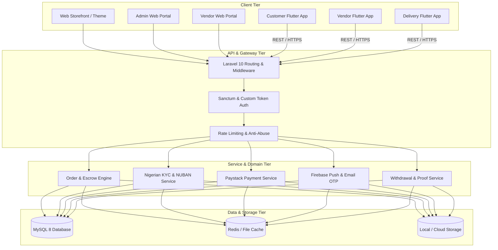

# 🏛️ Vmarket System Architecture

**Victorious MARKET (Vmarket) Enterprise Architecture Overview**

---

## 1. High-Level Topology

---

## 2. Component Specifications

### A. Backend (`backend/vmarket-web`)
* **Framework:** Laravel 10.x running on PHP 8.1+
* **Pattern:** Service-Repository Pattern with Eloquent ORM.
* **Database Access:** Eager loading (`with()`) enforced in Repositories to eliminate N+1 queries.
* **Authentication:** API Bearer tokens with AES encryption for sensitive endpoints.
* **Storage:** Unified storage symlink (`storage/app/public`) for KYC documents, product images, payment proofs, and audio recordings.

### B. Customer App (`User app/`)
* **Platform:** Flutter (Targeting Android SDK 34+ and iOS 15+)
* **State Management:** **Provider**
* **Dependency Injection:** **GetIt** (`lib/di_container.dart`)
* **Security:** `flutter_secure_storage` for token and session persistence.
* **Key Features:** Geolocation search, cart, Paystack checkout, live order tracking, chat, support tickets.

### C. Vendor App (`Vendor app/`)
* **Platform:** Flutter (Targeting Android SDK 34+ and iOS 15+)
* **State Management:** **Provider**
* **Dependency Injection:** **GetIt** (`lib/di_container.dart`)
* **Security:** `flutter_secure_storage`
* **Key Features:** Product & inventory management, daily revenue analytics, NUBAN bank resolution, 48-hr cooldown with OTP, optional NIN/CAC KYC submission.

### D. Delivery Rider App (`Delivery Man App/`)
* **Platform:** Flutter (Targeting Android SDK 34+ and iOS 15+)
* **State Management:** **GetX** (`lib/helper/get_di.dart`)
* **Key Features:** Map routing, active order assignment, Secret **Pickup OTP** verification, voice note messaging, payout requests with bank receipts.

---

## 3. Communication & Data Flow

1. **Client Request:** Mobile client sends HTTP POST/GET via Dio (Customer/Vendor) or GetConnect (Delivery Man).
2. **Middleware:** Laravel validates bearer token, rate limits, and localization headers.
3. **Controller:** Validates input with strict rules (e.g., mandatory image upload on withdrawal approval).
4. **Service:** Executes business logic (e.g. `NigerianKycService`, `PaystackBankService`).
5. **Database:** Atomic transactions with MySQL InnoDB.
6. **Response:** Structured JSON responses (`{ status: true, message: "...", data: {...} }`).
