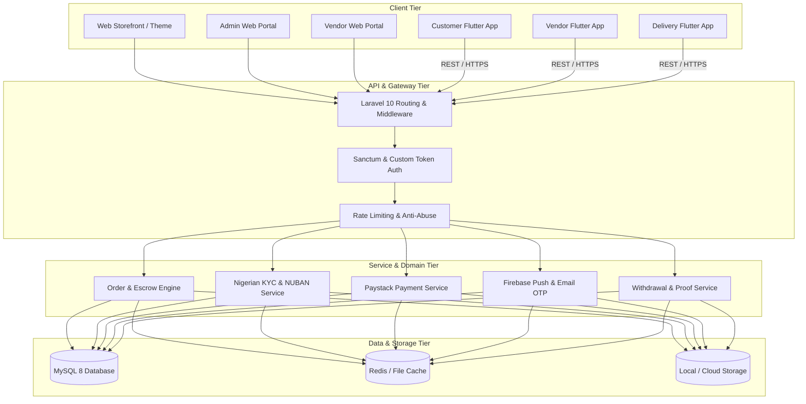

# 🏛️ Vmarket System Architecture

**Victorious MARKET (Vmarket) Enterprise Architecture Overview**

---

## 1. High-Level Topology

---

## 2. Component Specifications

### A. Backend (`backend/vmarket-web`)
* **Framework:** Laravel 10.x running on PHP 8.1+
* **Pattern:** Service-Repository Pattern with Eloquent ORM.
* **Database Access:** Eager loading (`with()`) enforced in Repositories to eliminate N+1 queries.
* **Authentication:** API Bearer tokens with AES encryption for sensitive endpoints.
* **Storage:** Unified storage symlink (`storage/app/public`) for KYC documents, product images, payment proofs, and audio recordings.
* **Authoritative Services:**
  - `FulfillmentAvailabilityService`: Authoritative directional delivery lane pricing (`Origin LGA -> Lane -> Destination LGA`) and in-shop pickup availability.
  - `DeliveryCheckoutIntentService`: Two-phase immutable checkout intent generation with deterministic SHA-256 fingerprint.
  - `DeliveryPaymentInitializationService`: Paystack payment attempt initialization and verification.
  - `PickupReservationService` & `PickupOrderSettlementService`: 24-hr stock hold reservation, store inspection, and payment settlement.
  - `CustomerCashbackService`: 5% Victorious Cashback ledger and redemption management.

### B. Customer App (`User app/`)
* **Platform:** Flutter (Targeting Android SDK 34+ and iOS 15+)
* **State Management:** **Provider**
* **Dependency Injection:** **GetIt** (`lib/di_container.dart`)
* **Security:** `StorageService` backed by `flutter_secure_storage` for token and session persistence.
* **Canonical Production Contract:** Strictly governed by `.agents/rules/VMARKET_CUSTOMER_APP_SPEC.md` (77 canonical sections). Zero client-side fee, price, or eligibility decisions.
* **Key Features:** Canonical LGA search, cart, Paystack checkout via two-phase intent, in-shop pickup reservation with store inspection, live order tracking, 5% cashback rewards ledger.

### C. Vendor App (`Vendor app/`)
* **Platform:** Flutter (Targeting Android SDK 34+ and iOS 15+)
* **State Management:** **Provider**
* **Dependency Injection:** **GetIt** (`lib/di_container.dart`)
* **Security:** `flutter_secure_storage`
* **Key Features:** Product & inventory management, daily revenue analytics, NUBAN bank resolution, 48-hr cooldown with OTP, optional NIN/CAC KYC submission, pickup reservation inspection verification (`/api/v3/seller/pickup-reservations/*`).

### D. Delivery Rider App (`Delivery Man App/`)
* **Platform:** Flutter (Targeting Android SDK 34+ and iOS 15+)
* **State Management:** **GetX** (`lib/helper/get_di.dart`)
* **Role:** Internal operational logistics infrastructure.
* **Key Features:** Directional lane dispatch, active order assignment, Secret **Pickup OTP** verification (vendor to rider), **Delivery OTP** verification (rider to customer), contactless digital settlement.

---

## 3. Communication & Data Flow

1. **Client Request:** Mobile client sends HTTP POST/GET via Dio (Customer/Vendor) or GetConnect (Delivery Man).
2. **Middleware:** Laravel validates bearer token, rate limits, and localization headers.
3. **Controller:** Validates input with strict rules; never trusts client-supplied fee or origin calculations.
4. **Service Layer:** Executes authoritative domain logic under atomic row locks where financial balances or inventory are involved.
5. **Database:** Atomic transactions with MySQL InnoDB; pessimistic locks (`->lockForUpdate()`).
6. **Response:** Structured JSON responses (`{ status: true, message: "...", data: {...} }`).

---

## 4. Canonical Governance & Production Alignment
- **Customer App Specification:** `.agents/rules/VMARKET_CUSTOMER_APP_SPEC.md` (77 canonical sections)
- **Customer App Rules:** `.agents/rules/CUSTOMER_APP_ALIGNMENT.md` (20 mandatory rules)
- **Customer App Alignment Plan:** `.agents/rules/CUSTOMER_APP_ALIGNMENT_PLAN.md` (34-phase plan)
- **Mathematical Invariant Proofs:** `VICTORIOUS_MARKET_MATHEMATICAL_AND_SYSTEMIC_PROOF.md`
