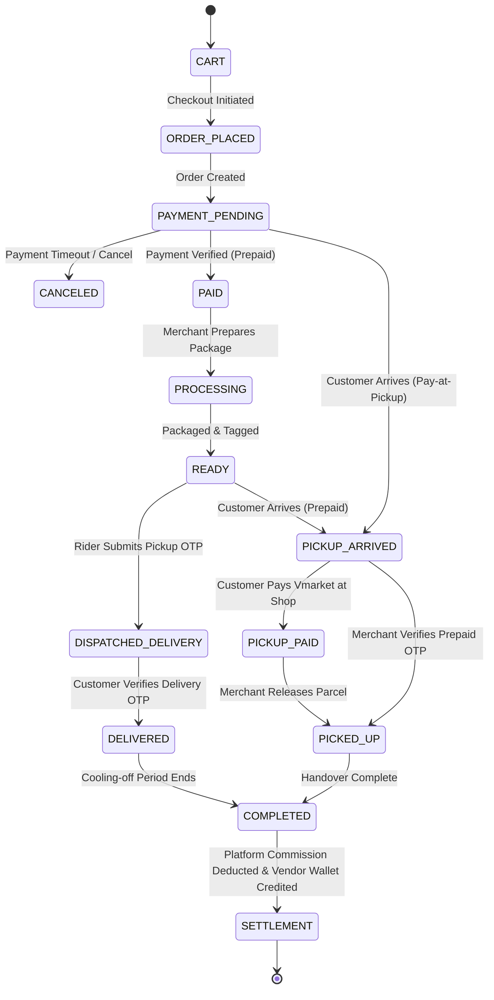

# 📜 Victorious MARKET (Vmarket) Ecosystem Business Rules & Architecture Master Specification

**Authoritative Domain Rules, Architectural Boundaries, and End-to-End Lifecycle Flows**

---

## 🏛️ Prime Directive: The Unified Platform Ecosystem

Victorious MARKET is designed and operated as **one complete commerce ecosystem**, not merely an uncoordinated listing board.

> **Key Principle:**  
> **Customer discovers and orders through Victorious MARKET.**  
> **Vendor supplies through Victorious MARKET.**  
> **Payment goes through Victorious MARKET.**  
> **Delivery and pickup are controlled by Victorious MARKET.**  
> **POS remains a completely separate system.**

---

# 1. CUSTOMER FLOWS

## A. Guest Browsing & Catalog Navigation
```text
Guest
  ↓
Open Victorious MARKET (Web Storefront or Customer Flutter App)
  ↓
Browse categories & taxonomy
  ↓
Search products (text, voice, filters)
  ↓
View product card & detail page
  ↓
View simple availability: [In Stock] or [Out of Stock] (exact inventory hidden)
  ↓
View merchant/store public profile (allowed public metadata only)
  ↓
Add to cart / Sign in to checkout
```

* **Data Privacy Invariant:** No vendor private phone number, private residential address, or internal warehouse details are ever exposed to guests or customers.
* **Stock Privacy Invariant:** Guests never see raw numeric inventory (`current_stock`). They only see binary availability (`in_stock` or `out_of_stock`).

---

# 2. CUSTOMER REGISTRATION & AUTHENTICATION

```text
Guest
  ↓
Initiate Registration (Phone or Email)
  ↓
System sends 6-digit cryptographic OTP (15-min expiry, max 5 attempts)
  ↓
Exact identity verification (exact string match, no fuzzy matching)
  ↓
Customer account created with secure credential hashing
  ↓
Set primary delivery location (State, LGA, Hub / Neighborhood)
  ↓
Start shopping with secure persistent bearer session
```

* **Supported Methods:** Phone number + SMS OTP, Email + Email OTP, and optional Google/Apple OAuth when configured by Super Admin.
* **Brute-Force Guard:** OTP verification enforces a maximum of 5 attempts (`max_otp_hit = 5`) and 15-minute expiration bound (`created_at + 15 mins < now()`).

---

# 3. PRODUCT DISCOVERY & VISIBILITY

```text
Customer
  ↓
Search / Category / Recommendation / Social Link / Feed
  ↓
Product query executed through single canonical scope:
  Product::marketplaceEligible()
    • status == 1 (Product Active)
    • request_status == 1 (Admin Approved)
    • seller.status == 'approved' (Seller Account Active)
    • seller.marketplace_status == 'approved' (Seller Marketplace Approved)
    • marketplace_listing_status == 'listed' (Listing Active)
    • marketplace_confirmed_at >= now - ConfigDays (Confirmation Fresh)
  ↓
Display Product:
  • 🟢 In Stock (if marketplace_availability == 'in_stock')
  • 🔴 Out of Stock (if marketplace_availability == 'out_of_stock')
```

* **Stock Anonymization Invariant:** The customer never sees the vendor's actual warehouse inventory or POS quantities. They only see `In Stock` or `Out of Stock`. Out-of-stock items remain discoverable but are not purchasable.

---

# 4. CART INTEGRATION & ELIGIBILITY ENFORCEMENT

```text
Product
  ↓
Customer taps "Add to Cart" or "Update Quantity"
  ↓
Backend Gatekeeper Validation (Product::marketplacePurchasable()):
  • Is the product Marketplace Eligible? (active, approved, listed, fresh)
  • Is marketplace_availability == 'in_stock'?
  ↓
  ├── YES ➔ Item added/updated in cart
  └── NO  ➔ Action rejected with localized user feedback:
            "This product is currently out of stock or unavailable."
```

* **Zero-Trust Client Boundary:** Frontend buttons and client state cannot be trusted. The server-side cart manager strictly re-evaluates `marketplacePurchasable()` on every cart addition, quantity increment, and checkout initiation.

---

# 5. NORMAL DELIVERY PURCHASE FLOW

```text
Customer
  ↓
Cart
  ↓
Checkout
  ↓
Choose Fulfillment: "Delivery to Address"
  ↓
Enter / select canonical delivery address (Country -> State -> LGA, Street, Landmark)
  ↓
Authoritative delivery fee calculated dynamically via Directional Delivery Lane (Origin LGA -> Lane -> Destination LGA)
  ↓
Frozen pre-order snapshot created via CheckoutIntent (POST /api/v1/checkout/intent)
  ↓
Customer pays Victorious MARKET via central Paystack gateway attempt (POST /api/v1/checkout/intent/{orderGroupId}/pay)
  ↓
Webhook / callback verifies payment cryptographically with atomic row-level lock
  ↓
Order settled and created in state: [processing] / [paid]
  ↓
Vendor receives order alert with item details (customer phone masked)
  ↓
Vendor prepares and packages product
  ↓
Secret physical Pickup OTP generated for handoff
  ↓
Approved delivery logistics rider assigned
  ↓
Rider arrives at vendor shop, enters Pickup OTP ➔ Order state: [out_for_delivery]
  ↓
Rider delivers package to customer address
  ↓
Customer inspects sealed package, provides Delivery OTP to rider
  ↓
Rider verifies Delivery OTP ➔ Order state: [delivered]
  ↓
Platform settlement engine unlocks vendor escrow balance (minus platform commission)
```

---

# 6. VENDOR PICKUP + PAY AT PICKUP (NIGERIAN MARKET ADAPTATION)

*This is the specialized Akwa Ibom / Nigerian market flow designed for local commerce trust.*

```text
Customer
  ↓
Cart ➔ Checkout
  ↓
Choose Fulfillment: "Pickup from Merchant"
  ↓
Select Payment Mode: "Pay at Pickup through Vmarket"
  ↓
In-Shop Pickup Reservation created in state: [pending_inspection] with 24-hr stock hold (₦0.00 pre-paid)
  ↓
Victorious MARKET provides approved merchant pickup instructions & 6-digit reservation code
  ↓
Customer arrives at designated merchant pickup premises
  ↓
Customer inspects physical merchandise and accepts condition
  ↓
Customer initiates digital payment to Victorious MARKET (Paystack Gateway: Card, Bank Transfer, USSD)
  ↓
Victorious MARKET webhook / API atomically verifies payment receipt
  ↓
Victorious MARKET sends digital release authorization & OTP to merchant
  ↓
Merchant releases physical merchandise to customer
  ↓
Order marked: [completed] / [picked_up]
```

* **Anti-Circumvention Rule:** The customer **NEVER pays cash or private transfer to the merchant**. Payment is strictly received by Victorious MARKET before release authorization is issued.
* **No Off-Platform Negotiation:** The customer and merchant do not negotiate private pricing or terms; all terms derive from the Vmarket order.

---

# 7. VENDOR PICKUP + PREPAID FLOW

```text
Customer
  ↓
Cart ➔ Checkout
  ↓
Choose Fulfillment: "Pickup from Merchant"
  ↓
Select Payment Mode: "Pay Online Now"
  ↓
Customer pays Victorious MARKET immediately
  ↓
Order created in state: [paid] / [processing]
  ↓
Merchant prepares package
  ↓
When ready, merchant marks: [ready_for_pickup]
  ↓
Customer receives Pickup Authorization Code & venue directions
  ↓
Customer arrives at merchant location, presents Authorization Code
  ↓
Merchant verifies Authorization Code via Vendor Portal / App
  ↓
Merchant releases product
  ↓
Order state: [picked_up] ➔ [completed]
```

---

# 8. CANCELLATION BEFORE PAYMENT (PAY-AT-PICKUP / UNPAID)

```text
Unpaid Pickup / Delivery Order
  ↓
Customer cancels order OR payment timeout expires (e.g. 24 hours)
  ↓
Order status updated to [canceled]
  ↓
Merchant notified immediately: "Order cancelled by customer"
  ↓
No financial transaction took place; zero balance adjustments
  ↓
Merchant product listing remains available and unaffected
```

---

# 9. CANCELLATION AFTER PREPAYMENT

```text
Paid Order
  ↓
Customer requests cancellation before order advances to [out_for_delivery]
  ↓
Victorious MARKET automated policy inspection:
  ├── If merchant has NOT dispatched: Cancellation approved
  └── If rider already dispatched: Cancellation requires support dispute resolution
  ↓
If Approved:
  • Order marked [canceled]
  • Automated refund routed back via Paystack to customer's originating bank account (and Victorious Points restored if redeemed)
  • Merchant notified of cancellation
```

---

# 10. PRODUCT REAL-TIME AVAILABILITY TOGGLE

```text
Merchant
  ↓
Product becomes physically exhausted or temporarily unavailable
  ↓
Merchant opens Vendor Web Portal or Vendor Flutter App
  ↓
Toggles availability: [In Stock] ➔ [Out of Stock]
  ↓
Endpoint: POST /api/v3/seller/products/{id}/toggle-availability
  ↓
Immediate Effect:
  • Product remains listed and discoverable in search/categories
  • Storefront displays prominent [Out of Stock] badge
  • "Add to Cart" and "Buy Now" are strictly disabled
```

* **No Stock Tampering:** The merchant never adjusts numeric stock quantities on the marketplace. Availability is strictly binary.

---

# 11. 7-DAY MARKETPLACE FRESHNESS CONFIRMATION

```text
Merchant lists product on Victorious MARKET
  ↓
Merchant explicitly triggers "Confirm Freshness" action
  ↓
Backend records:
  • marketplace_confirmed_at = now()
  • marketplace_listing_status = 'listed'
  ↓
Freshness lifecycle begins (active for Admin-configured interval, default 7 days)
  ↓
During this window:
  • Product participates in all marketplace searches, feeds, and recommendations
  • Merchant can freely toggle [In Stock] / [Out of Stock] without losing freshness
```

* **Configurable Freshness Bound:** The confirmation duration is governed by Admin configuration (`getMarketplaceConfirmationDays()`, default: 7 days). It is never hardcoded.

---

# 12. AUTOMATIC LISTING EXPIRY (DYNAMIC & SCHEDULED)

```text
7 Days Elapse without Merchant Reconfirmation
  ↓
Dynamic Query Evaluation:
  • (marketplace_confirmed_at < now() - 7 days) ➔ isMarketplaceFresh() == false
  • Product IMMEDIATELY disappears from public search, category feeds, and recommendations
  ↓
Scheduled Daily Maintenance Cron (00:05 UTC):
  • Command: php artisan products:check-marketplace-freshness
  • Identifies stale listed products
  • Atomically updates: marketplace_listing_status = 'unlisted'
  • Dispatches notification to vendor: "Listing expired due to 7-day confirmation window"
```

* **Protection Invariant:** The product is **NEVER deleted**. It remains safely in the vendor's catalog in an `unlisted` state, awaiting a simple reconfirmation.

---

# 13. VENDOR RECONFIRMATION & RELISTING

```text
Merchant reviews catalog in Vendor App / Web Portal
  ↓
Sees badge: [Listing Expired] or [Unlisted]
  ↓
Merchant taps: [Confirm & Relist] or uses [Bulk Confirm]
  ↓
Backend verification:
  • Validates merchant ownership (Zero-Trust IDOR check)
  • Validates merchant account is still active and marketplace-approved
  ↓
Atomically updates:
  • marketplace_confirmed_at = now()
  • marketplace_listing_status = 'listed'
  ↓
Product instantly restored to full public marketplace visibility
```

---

# 14. VENDOR OUT-OF-STOCK VS. UNLISTED SEMANTICS

| State Attribute | **In Stock** | **Out of Stock** | **Unlisted** |
| :--- | :--- | :--- | :--- |
| **Marketplace Discoverable?** | ✅ Yes | ✅ Yes (browse/search) | ❌ No |
| **Add to Cart Allowed?** | ✅ Yes | ❌ No | ❌ No |
| **Google/Meta/TikTok Feed?** | ✅ Yes | ❌ Excluded (or tagged out_of_stock) | ❌ Excluded |
| **Requires Freshness?** | ✅ Yes | ✅ Yes | N/A |
| **Intent** | Ready for purchase | Catalog showcase; restocking soon | Hidden from marketplace |

---

# 15. RESTORING AVAILABILITY TO IN-STOCK

```text
Merchant
  ↓
Sets Out of Stock ➔ In Stock
  ↓
Backend checks:
  • Is the product currently fresh? (marketplace_confirmed_at >= now - 7d)
  ├── If FRESH: Purchasability immediately restored
  └── If EXPIRED: Merchant must execute [Confirm & Relist] before customers can buy
```

---

# 16. NEW MERCHANT ONBOARDING & APPLICATION

```text
Prospective Business Owner
  ↓
Submits Merchant Registration via Web or Vendor App
  ↓
Fills basic business profile (Store Name, Phone, Email, Bank Account / NUBAN)
  ↓
Account created in state: status = 'pending', marketplace_status = 'pending'
  ↓
Super Admin reviews merchant application in Command Center
  ↓
Decision:
  ├── REJECT ➔ Merchant notified with reason
  └── APPROVE ➔ Account status = 'approved'; marketplace_status = 'approved'
```

---

# 17. MERCHANT VERIFICATION TIERS

```text
Approved Merchant (Level 1: Basic Merchant)
  ↓
Merchant submits enhanced compliance documentation:
  • CAC Corporate Registration Certificate
  • National Identity (NIN) verification
  • NUBAN Bank Account name resolution match score
  • Physical business premises photos
  ↓
Super Admin inspects compliance dossier
  ↓
Admin grants: [Verified Merchant 🛡️] badge
  ↓
Benefits: Higher product showcase priority, trust badge on storefront, higher transaction limits
```

---

# 18. MERCHANT SUSPENSION & SANCTIONS

```text
Merchant commits policy violation / excessive delivery failures / dispute fraud
  ↓
Super Admin suspends merchant (status = 'suspended')
  ↓
Immediate System-Wide Ripple Effect:
  • All vendor products dynamically excluded from marketplace queries
  • Active product feeds immediately omit vendor listings
  • Vendor blocked from adding products or initiating withdrawals
  • Active in-flight orders are fulfilled or refunded according to admin review
  • Products remain preserved in database (never deleted)
```

---

# 19. PRODUCT CREATION LIFECYCLE

```text
Merchant creates new product
  ↓
Inputs title, description, photos, pricing, category, standard identifiers (GTIN/MPN)
  ↓
Initial System Assignment:
  • status = 0 or 1 (depending on admin moderation policy)
  • request_status = 0 (pending admin review)
  • marketplace_listing_status = 'unlisted'
  • marketplace_availability = 'out_of_stock'
  • marketplace_confirmed_at = null
  ↓
Super Admin approves product (request_status = 1)
  ↓
Merchant explicitly marks [In Stock] and triggers [Confirm Freshness]
  ↓
Product becomes fully active and purchasable on Victorious MARKET
```

---

# 20. ORDINARY PRODUCT EDITS DO NOT RENEW FRESHNESS

```text
Merchant edits existing product details:
  • Modifies title, description, images, price, or attributes
  ↓
System saves updates to database
  ↓
Crucial Invariant:
  • marketplace_confirmed_at is NOT touched
  • marketplace_listing_status is NOT touched
```

* **Rationale:** Prevents merchants from making trivial text edits to artificially bypass the mandatory 7-day confirmation cycle. Freshness can only be renewed via intentional confirmation.

---

# 21. PRODUCT STATE TAXONOMY

A product's state in Victorious MARKET is decomposed across five orthogonal dimensions:

```text
Product Master
├── 1. Product Status (status: 0 = Disabled, 1 = Enabled)
├── 2. Admin Moderation (request_status: 0 = New/Pending, 1 = Approved, 2 = Denied)
├── 3. Merchant Marketplace Approval (seller.marketplace_status: 'approved', 'pending', 'suspended')
├── 4. Marketplace Listing (marketplace_listing_status: 'listed' vs 'unlisted')
├── 5. Marketplace Availability (marketplace_availability: 'in_stock' vs 'out_of_stock')
└── 6. Marketplace Freshness (marketplace_confirmed_at >= now - ConfigDays)
```

---

# 22. MULTI-CHANNEL PRODUCT FEEDS (GOOGLE / META / TIKTOK)

```text
Victorious MARKET Feed Engine (/products/feed/{channel})
  ↓
Zero-Trust Tenant Scoping:
  • Global Feeds: Authenticated via Super Admin token
  • Vendor Feeds: Authenticated via unique vendor token (vm_vfeed_...)
  ↓
Feed Query Constraint:
  • Enforces scopeMarketplaceEligible()
  • Automatically filters out unlisted, expired, unapproved, or suspended products
  ↓
Channel Formatter:
  • Google Shopping XML: Outputs <g:gtin>, <g:mpn>, <g:google_product_category>, <g:availability>
  • Meta / Facebook CSV: Outputs standard catalog schema with direct Vmarket deep-links
  • TikTok Catalog CSV: Formats products for TikTok Shop synchronization
```

---

# 23. ORDER PAYMENT & ATOMIC ROW-LEVEL LOCKING

```text
Customer initiates payment at checkout
  ↓
Payment Gateway (Paystack) processes transaction
  ↓
Webhook / IPN received by Victorious MARKET
  ↓
Atomic Concurrency Guard:
  DB::transaction(function() {
      $affected = DB::table('payment_requests')
          ->where('id', $requestId)
          ->where('is_paid', 0)
          ->update(['is_paid' => 1, 'transaction_id' => $trxId]);
      
      if ($affected > 0) {
          // Execute success hook ONCE
          OrderManager::digital_payment_success($paymentData);
      }
  });
```

* **Double-Execution Guard:** If `$affected == 0`, the transaction was already processed by a concurrent callback; execution terminates immediately to prevent duplicate orders or duplicate wallet credits.

---

# 24. PAYMENT FAILURE LIFECYCLE

```text
Customer card declined / insufficient funds / network timeout
  ↓
Payment gateway emits failure callback
  ↓
Order remains in [pending_payment] status
  ↓
Customer presented with retry screen offering alternative payment methods (Card, Transfer, USSD)
  ↓
Unpaid orders expire after system timeout (default 24 hours) without locking inventory
```

---

# 25. WEBHOOK IDEMPOTENCY

* Every payment gateway callback is cryptographically validated using the gateway's secret HMAC signature.
* Redundant webhooks for already-processed payment requests are safely acknowledged with HTTP 200 without executing side-effects.

---

# 26. DELIVERY DISPATCH & TWO-FACTOR OTP HANDOFF

```text
Paid Order
  ↓
Vendor finishes packing ➔ Marks [ready_for_delivery]
  ↓
Secret 4-digit Pickup OTP generated and stored in order record
  ↓
Logistics dispatch engine assigns nearest vetted delivery rider
  ↓
Rider arrives at vendor store ➔ Requests Pickup OTP from vendor
  ↓
Rider inputs Pickup OTP into Delivery App ➔ System unlocks physical handoff
  ↓
Order state advances to: [out_for_delivery]
  ↓
Rider arrives at customer location ➔ Customer inspects package
  ↓
Customer provides 6-digit Delivery OTP to rider
  ↓
Rider submits Delivery OTP ➔ Order state: [delivered]
```

---

# 27. OPEN DELIVERY LOGISTICS ONBOARDING

```text
Independent Rider or Third-Party Logistics (3PL) Company
  ↓
Submits application via Logistics Portal
  ↓
Provides vehicle papers, driver's license, guarantor forms, and NUBAN bank details
  ↓
Admin performs identity verification and background check
  ↓
Approved ➔ Rider receives login credentials for Delivery Man Flutter App
```

---

# 28. RIDER DATA PRIVACY & LEAST PRIVILEGE

* **Need-to-Know Routing:** The rider receives only the delivery recipient's name, phone number, and physical delivery address.
* **Customer Isolation:** The rider does not have access to the customer's total order history, payment instrument details, or financial balances.
* **Vendor Financial Isolation:** The rider does not see vendor wholesale costs, platform commission rates, or merchant wallet balances.

---

# 29. DELIVERY FAILURE & RETURN PROTOCOL

```text
Rider arrives at destination but cannot reach customer after 3 verified attempts
  ↓
Rider logs "Customer Unreachable" in Delivery App with GPS timestamp
  ↓
Order flagged for Victorious MARKET Logistics Support intervention
  ↓
Resolution Pathways:
  ├── 1. Customer contacted ➔ Delivery rescheduled for next dispatch window
  └── 2. Order permanently undeliverable ➔ Rider returns parcel to vendor / central hub;
         Return confirmation OTP executed; Order marked [failed_delivery]
```

---

# 30. PICKUP FAILURE RESOLUTION PROTOCOL

```text
Customer arrives at merchant premises for scheduled pickup, but merchant cannot supply
  ↓
Customer immediately taps [Report Pickup Issue] in Customer App or contacts Support
  ↓
Victorious MARKET support hotline contacts merchant directly
  ↓
Resolution Pathways:
  ├── 1. Merchant fulfills with customer consent (minor delay)
  └── 2. Immediate Cancellation: Order cancelled; if prepaid, customer refunded instantly;
         Merchant penalized for availability violation
```

---

# 31. CENTRALIZED CUSTOMER SUPPORT & ESCALATION

* **Zero Direct Vendor Harassment:** All customer complaints, delivery inquiries, and payment questions are handled exclusively by Victorious MARKET Support.
* **Structured Ticket System:** Issues are categorized (Payment, Quality, Delayed Delivery, Merchant Conduct) and tracked with strict SLA resolution times.

---

# 32. MERCHANDISE RETURN PROTOCOL

```text
Customer files Return Request within eligible return window (e.g. 48 hours of delivery)
  ↓
Victorious MARKET evaluates return eligibility (hygiene exclusions, physical tampering)
  ↓
If Approved:
  • Approved logistics rider dispatched to retrieve item from customer
  • Item returned to merchant or inspection hub
  • Merchant inspects item condition
  ↓
Refund or replacement authorized based on return inspection report
```

---

# 33. REFUND DISBURSEMENT

```text
Approved Refund Authorized by Super Admin
  ↓
System executes atomic refund transaction:
  • Option A: Direct reversal via Paystack API to customer's originating bank account
  • Option B: Victorious Points adjustment (if order utilized or earned cashback points)
  ↓
Order record permanently annotated with refund transaction reference and reason code
```

---

# 34. VENDOR SETTLEMENT & ESCROW RELEASE

```text
Order status transitions to [delivered] or [picked_up]
  ↓
Hold Period (cooling-off window for returns, e.g. 24–48 hours)
  ↓
Settlement Calculation:
  Gross Product Price
  - Platform Commission (% set by Admin, e.g. 10%)
  - Applicable Tax / Regulatory Fees
  = Net Vendor Payable
  ↓
Pessimistic Balance Transaction:
  DB::transaction(function() {
      $vendorWallet = SellerWallet::where('seller_id', $sellerId)->lockForUpdate()->first();
      $vendorWallet->balance += $netVendorPayable;
      $vendorWallet->save();
  });
```

---

# 35. VENDOR WITHDRAWAL PROTOCOL

```text
Vendor requests payout from accumulated wallet balance
  ↓
System Integrity Checks:
  • Balance sufficient? (requested_amount <= available_balance)
  • Bank account cooldown active? (must be false)
  • KYC verification active?
  ↓
Withdrawal record created in state: [pending]
  ↓
Super Admin inspects request in Admin Portal
  ↓
Admin performs electronic transfer to vendor's registered NUBAN account
  ↓
Mandatory Security Invariant:
  Admin CANNOT approve withdrawal without uploading a verified payment proof receipt image
  ↓
Vendor wallet balance debited atomically; withdrawal marked [approved]
```

---

# 36. VENDOR BANK ACCOUNT COOLDOWN & ANTI-THEFT PROTECTION

```text
Vendor requests to update linked NUBAN bank account
  ↓
Step 1: System sends 6-digit cryptographic OTP to vendor's primary registered email
  ↓
Step 2: Vendor enters matching OTP
  ↓
Step 3: Account updated AND 48-Hour Withdrawal Lock activated:
  • bank_updated_at = now()
  • Cooldown rule: bank_updated_at + 48 hours > now()
  ↓
Effect: Vendor CANNOT withdraw funds for 48 hours following any bank detail change,
preventing compromised sessions from immediately draining vendor earnings.
```

---

# 37. ADMIN PRODUCT MODERATION & QUALITY ASSURANCE

* Super Admin Command Center retains unilateral moderation authority over all catalog items.
* Products can be rejected or unpublished at any time for inappropriate content, incorrect pricing, or trademark infringements.

---

# 38. ADMIN MERCHANT CONTROLS

Super Admin maintains comprehensive governance over all merchant accounts:
* **Approve / Reject:** On initial registration.
* **Verify / Unverify:** Grant or revoke Verified Merchant badge based on CAC/NIN audit.
* **Suspend / Reinstate:** Temporary freeze for investigations.
* **Commission Customization:** Set platform commission rate globally or per individual merchant.

---

# 39. ADMIN MARKETPLACE POLICY GOVERNANCE

The Victorious MARKET backend enforces policies dynamically via Admin settings:
* **Confirmation Interval:** Number of days before unlisted (default: 7).
* **Require Freshness:** Boolean switch to toggle strict freshness filtering.
* **Auto-Unlisting Cron:** Enable/disable automated cleanup job.
* **Fulfillment Modes:** Toggle delivery, vendor pickup, or hub pickup availability.
* **Pickup Payment Modes:** Toggle Pay-at-Pickup vs. Prepaid Pickup.

> **Principle:** Code enforces the policy invariant; Super Admin configuration parameterizes the operational values.

---

# 40. SYSTEM INTEGRITY & FRESHNESS CRON

* **Schedule:** Runs daily at 00:05 UTC (`products:check-marketplace-freshness`).
* **Role:** Acts as the garbage collector and catalog synchronizer.
* **Dynamic Safety:** Even if the cron fails to run, the real-time `scopeMarketplaceEligible()` query dynamically excludes stale listings on every HTTP request.

---

# 41. ZERO-TRUST IDOR & TENANT ISOLATION

Every vendor route and controller method strictly scopes queries to the authenticated tenant:
```php
Product::where('id', $id)
    ->where('user_id', auth('seller')->id())
    ->where('added_by', 'seller')
    ->firstOrFail();
```
* Vendor A can **NEVER** confirm, relist, update availability, or inspect products belonging to Vendor B.
* Anti-Mass-Assignment prevents injecting `marketplace_listing_status`, `is_paid`, or `role_id` through ordinary product forms.

---

# 42. BUYER-SELLER DIRECT CHAT HARD-DISABLED

* To prevent transaction circumvention, off-platform fraud, and harassment, direct chat between customer and vendor is **completely disabled**.
* Customers interact exclusively with Victorious MARKET Customer Support.
* In-app communication between Rider and Vendor is permitted strictly for logistics coordination during active order handoffs.

---

# 43. SOCIAL COMMERCE & INBOUND ACQUISITION

```text
Victorious MARKET Product
  ↓
Automated OpenGraph, Meta Tags, and SEO Canonicalization
  ↓
Shared to Social Channels (WhatsApp, Facebook, Instagram, TikTok, Google)
  ↓
Prospect clicks link ➔ Directly lands on Victorious MARKET Product Detail Page
  ↓
Product verified fresh & in-stock ➔ Prospect completes purchase within ecosystem
```

---

# 44. MULTI-CHANNEL COMMERCE ENGINE

```text
Victorious MARKET Canonical Catalog
  │
  ├── Storefront Web Theme
  ├── Customer Mobile App (Flutter)
  ├── Google Merchant Center XML Feed
  ├── Meta / Facebook Commerce CSV Feed
  ├── TikTok Shop Product Feed
  └── WhatsApp AI Sales Agent
```
All channels represent projections of the **single authoritative backend catalog**, ensuring unified pricing and stock status across the web.

---

# 45. END-TO-END DELIVERY JOURNEY

1. **Discovery:** Customer discovers a mattress on Facebook via Victorious MARKET feed.
2. **Evaluation:** Opens Victorious MARKET app; sees `🟢 In Stock`.
3. **Cart & Checkout:** Adds to cart, selects home delivery to Uyo, pays via Paystack.
4. **Order Confirmation:** Payment verified by webhook with atomic lock; order state: `processing`.
5. **Fulfillment:** Merchant packages mattress; secret 4-digit Pickup OTP generated.
6. **Dispatch:** Logistics rider arrives at merchant shop, submits Pickup OTP, takes parcel.
7. **Delivery:** Rider delivers to customer residence; customer inspects and provides Delivery OTP.
8. **Settlement:** Order marked `delivered`; net proceeds credited to merchant wallet escrow.

---

# 46. END-TO-END VENDOR PICKUP JOURNEY (PAY-AT-PICKUP)

1. **Discovery:** Customer finds a smartphone on Victorious MARKET storefront.
2. **Selection:** Customer chooses `Pickup from Merchant` + `Pay at Pickup through Vmarket`.
3. **Order Placed:** Order generated in state `pending_payment` / `pickup_scheduled`.
4. **Coordination:** Customer arrives at merchant's verified shop in Uyo and contacts Vmarket.
5. **Physical Inspection:** Merchant presents smartphone; customer inspects and accepts device.
6. **Central Payment:** Customer initiates payment of order amount to Victorious MARKET via USSD/transfer.
7. **Digital Release:** Vmarket webhook confirms receipt, sends release OTP to merchant.
8. **Handoff:** Merchant releases smartphone to customer; order completed; merchant balance updated.

---

# 47. UNIFIED ORDER STATE MACHINE



---

# 48. THE BIG PICTURE: DOMAIN RESPONSIBILITIES & POS SEPARATION

| Domain | Core Responsibilities |
| :--- | :--- |
| **Customer** | Catalog browsing, search, persistent cart, payments, delivery tracking, ticket support. |
| **Merchant** | Product management, binary availability toggles, order preparation, settlement withdrawals. |
| **Marketplace** | Listing governance, dual approval, 7-day freshness lifecycle, discovery algorithms. |
| **Payments** | Centralized escrow, atomic row-level locks, cryptographic webhooks, refund disbursement. |
| **Fulfillment** | Two-factor OTP handoffs, logistics dispatch, route optimization, pickup coordination. |
| **Delivery** | Third-party logistics network, rider allocation, proof-of-delivery validation. |
| **Pickup** | Merchant storefront pickups and future neighborhood logistics hubs. |
| **Support** | Centralized dispute handling, customer satisfaction, anti-circumvention enforcement. |
| **Settlement** | Platform commission calculation, escrow release, NUBAN payouts with proof. |
| **Admin** | System policy configuration, catalog moderation, merchant verification, audit governance. |
| **Channels** | Multi-channel synchronization (Web, Mobile Apps, Google, Meta, TikTok, WhatsApp). |
| **Security** | Zero-trust IDOR scoping, anti-mass-assignment, bank change cooldowns, OTP locks. |

---

## 🔒 The POS Separation Invariant

> **Architectural Law:**  
> **The POS (Point of Sale) repository and retail in-store ERP remain completely separate.**  
>
> The Victorious MARKET marketplace does not inspect, read, or write numeric warehouse quantities or POS drawer shifts. The marketplace operates strictly on **binary availability (`in_stock` / `out_of_stock`)** backed by the **periodic 7-day freshness reconfirmation**.  
>
> Future integrations with external POS systems occur strictly through asynchronous, decoupled API bridges without cross-database coupling.
