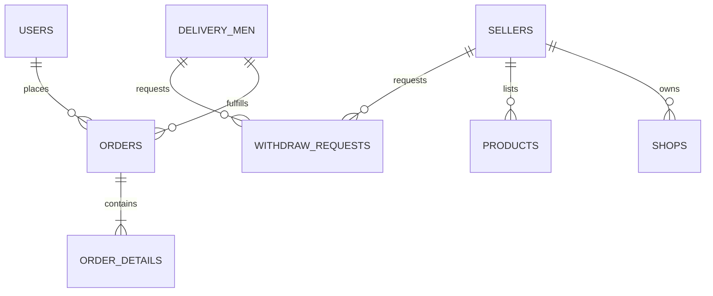

# 🗄️ Vmarket Database Architecture

**MySQL 8 Authoritative Schema & Relationship Documentation**

---

## 1. Key Database Entities

---

## 2. Core Tables & Specialized Fields

### A. `sellers` Table
* `id` (BIGINT, Primary Key)
* `f_name`, `l_name` (VARCHAR)
* `phone`, `email` (VARCHAR, Unique)
* `status` (ENUM: `pending`, `approved`, `rejected`, `suspended`)
* `bank_name`, `branch`, `account_no`, `holder_name` (VARCHAR)
* `bank_updated_at` (TIMESTAMP) — Used to calculate the 48-hour withdrawal cooldown.
* `bank_otp`, `bank_otp_expires_at` (VARCHAR, TIMESTAMP) — Email OTP authorization.
* `nin`, `nin_document` (VARCHAR) — National Identity Slip data.
* `cac_number`, `cac_document` (VARCHAR) — Corporate Affairs Commission data.
* `kyc_status` (ENUM: `unverified`, `submitted`, `verified`, `rejected`) — Verification state.
* `kyc_reviewed_at`, `kyc_notes` (TIMESTAMP, TEXT)

### B. `withdraw_requests` Table
* `id` (BIGINT, Primary Key)
* `seller_id`, `delivery_man_id`, `admin_id` (BIGINT, Foreign Keys)
* `amount` (DECIMAL 24, 2)
* `request_updated_at` (TIMESTAMP)
* `status` (ENUM: `pending`, `approved`, `denied`)
* `transaction_note` (TEXT)
* `proof_of_payment` (VARCHAR) — Path to the mandatory payment transfer screenshot.

### C. `orders` Table
* `id` (BIGINT, Primary Key)
* `customer_id`, `seller_id`, `delivery_man_id` (BIGINT)
* `order_status` (ENUM: `pending`, `confirmed`, `processing`, `out_for_delivery`, `delivered`, `returned`, `failed`, `canceled`)
* `payment_status` (ENUM: `paid`, `unpaid`)
* `pickup_verification_code` (VARCHAR) — Secret 4-digit Vendor Pickup OTP (rider collects package from vendor).
* `verification_code` (VARCHAR) — 6-digit Customer Delivery OTP (customer confirms doorstep receipt) OR Customer Pickup Handover OTP (customer receives goods at vendor shop after payment).
* `received_at` (TIMESTAMP) — Records actual customer receipt timestamp; starts 24-hour return window.
* `payment_method` (VARCHAR) — V1 supports: `paystack`, `digital_payment` (prepaid online). COD/offline payment methods decommissioned in V1.

### D. `delivery_man_wallets` Table
* `delivery_man_id` (BIGINT, Foreign Key)
* `current_balance` (DECIMAL 24, 2) — Rider earnings from completed deliveries.
* `cash_in_hand` (DECIMAL 24, 2) — **Decommissioned in V1 (always 0.00)**. Riders handle zero customer merchandise cash in V1.
* `total_withdrawn` (DECIMAL 24, 2)
