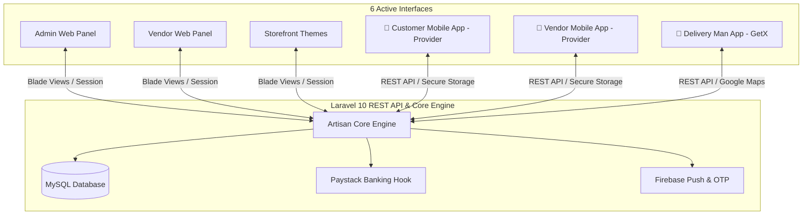

# 🛒 Victorious MARKET — Nigerian Multi-Vendor E-Commerce Ecosystem

<div align="center">


**Victorious MARKET (Vmarket)** is a secure, high-performance multi-vendor e-commerce platform engineered specifically for modern trade, logistics, and retail in **Nigeria**.

</div>

---

## 🏗️ Ecosystem Architecture

The Vmarket ecosystem consists of **1 unified Laravel Backend** (serving the REST API, Super Admin Panel, Vendor Panel, and Storefront web views) and **3 Native Flutter Mobile Applications**:



| Component | Path | Stack | State Mgmt / Auth | Description |
| :--- | :--- | :--- | :--- | :--- |
| **Backend & Web** | [backend/vmarket-web](file:///c:/Users/USER/Downloads/vmarket/backend/vmarket-web) | Laravel 10, PHP 8.1+, MySQL | Session-based / Cookies | Central REST API, Super Admin Web Dashboard, Vendor Web Portal, and Storefront views. |
| **Customer App** | [User app/](file:///c:/Users/USER/Downloads/vmarket/User%20app) | Flutter 3.x, Dart | **Provider** / `flutter_secure_storage` | Shopping client for iOS & Android: product search, cart, Paystack checkout, and live tracking. |
| **Vendor App** | [Vendor app/](file:///c:/Users/USER/Downloads/vmarket/Vendor%20app) | Flutter 3.x, Dart | **Provider** / `flutter_secure_storage` | Store management client: inventory, sales analytics, orders, bank info, and KYC uploads. |
| **Delivery App** | [Delivery Man App/](file:///c:/Users/USER/Downloads/vmarket/Delivery%20Man%20App) | Flutter 3.x, Dart | **GetX** / `flutter_secure_storage` | Dispatch rider client: map navigation, order assignment, Pickup OTP validation, and voice note communications. |

---

## 🌟 Key Features & Business Rules

### 1. 🛡️ Nigerian Merchant Identity Verification (KYC)
* **Real-Time NUBAN Bank Resolution:** Integrates with the **Paystack bank verification API** to resolve the official registered name of a bank account as soon as the 10-digit NUBAN number is entered.
* **Algorithmic Name Matching:** Compares the resolved bank account name against both the **Vendor's Personal Name** and **Corporate Shop Name** (filtering legal noise words like `LTD`, `PLC`, `ENTERPRISES`).
* **Admin Verification Hub:** Super Admin can inspect match scores and approve or reject KYC with a single click.

### 2. 🔒 Bank Account Security & Cooldown
* **48-Hour Cooldown Lock:** Any update to a vendor's bank details triggers a strict **48-hour cooldown lockout** where withdrawal requests are blocked to prevent unauthorized account draining.
* **6-Digit Email OTP:** Modifying bank details requires entering a cryptographic security code dispatched to the vendor's email.

### 3. 📸 Mandatory Payout Proof Screenshots
* **Dispute Prevention:** Attachments of bank transfer transaction receipts are **strictly mandatory** for Super Admin to approve payout requests.
* **In-App Receipt Previews:** Both vendors and riders can view their transfer receipts directly within their transaction history.

### 4. 📦 Logistics & Dispatch Safety (Pickup OTP)
* **Physical Handoff Protection:** Delivery riders must enter a unique **48-hour Pickup OTP** upon arriving at a vendor's shop to confirm physical possession of goods before departing for delivery.

---

## 🚀 Quick Start & Installation

### 1. Prerequisites
* **PHP 8.1+** with extensions: `BCMath`, `Ctype`, `Fileinfo`, `Mbstring`, `PDO`, `Tokenizer`, `XML`, `cURL`.
* **MySQL 8.0+**
* **Composer 2.x**
* **Flutter SDK 3.24+**

---

### 2. Backend Setup
```bash
# Navigate to the backend directory
cd "backend/Admin and web new install V16.1"

# Install PHP dependencies
composer install --no-dev --optimize-autoloader

# Copy and configure environment variables
cp .env.example .env
php artisan key:generate

# Run database migrations
php artisan migrate

# Create storage symlink
php artisan storage:link

# Start local development server
php artisan serve
```

#### Admin Login Credentials (Default):
* **URL:** `http://localhost:8000/login/admin`
* **Email:** `admin@admin.com`
* **Password:** `12345678`

---

### 3. Mobile Apps Setup
```bash
# For Customer App
cd "User app"
flutter pub get
flutter run

# For Vendor App
cd "../Vendor app"
flutter pub get
flutter run

# For Delivery Man App
cd "../Delivery Man App"
flutter pub get
flutter run
```

---

## 🛡️ Development & AI Governance Rules

All developers and AI assistants must follow the standards established in [.agents/AGENTS.md](file:///c:/Users/USER/Downloads/vmarket/.agents/AGENTS.md):
1. **Mandatory Git Commits:** Every task, fix, or feature must be committed atomically before ending the session.
2. **Mandatory Logging:** All modifications must be documented in [AI_CHANGELOG.md](file:///c:/Users/USER/Downloads/vmarket/AI_CHANGELOG.md).
3. **State Management Standards:**
   - `User app` & `Vendor app` $\rightarrow$ **Provider** + **GetIt** (`lib/di_container.dart`).
   - `Delivery Man App` $\rightarrow$ **GetX** (`lib/helper/get_di.dart`).
4. **Security:** Sensitive tokens must be stored exclusively via `flutter_secure_storage`.
5. **No Direct Settings DB Writes:** Settings updates must go through Eloquent model layers (`updateOrCreate()`) rather than raw query builder statements to ensure setting cache invalidation hooks are fired.

---

## 📄 License & Copyright

© 2026 **Victorious MARKET**. All Rights Reserved.  
Engineered for excellence in digital African commerce.
