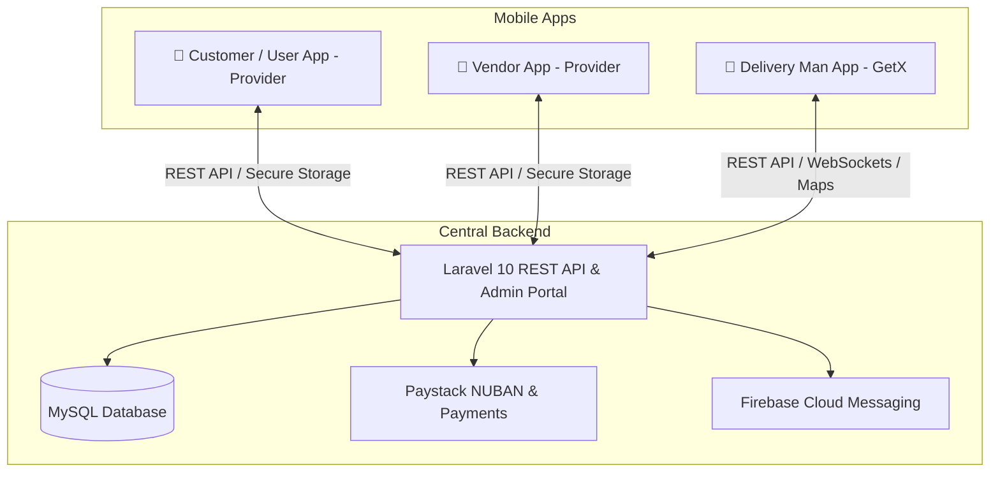

# 🛒 Victorious MARKET — Nigerian Multi-Vendor E-Commerce Ecosystem

<div align="center">


**Victorious MARKET** is an enterprise-grade, high-performance, and secure multi-vendor e-commerce platform engineered specifically for modern trade, logistics, and retail in **Nigeria**.

</div>

---

## 🏗️ Ecosystem Architecture

The Victorious MARKET ecosystem comprises **1 Laravel Backend API & Super Admin Web Portal** and **3 Native Flutter Mobile Applications**:



| Component | Path | Technology | Description |
| :--- | :--- | :--- | :--- |
| **Backend & Web** | `backend/Admin and web new install V16.1` | Laravel 10, PHP 8.1+, Blade, MySQL | Central REST API, Super Admin Dashboard, Vendor Web Portal, and Storefront. |
| **Customer App** | `User app/` | Flutter 3.x, Dart, Provider, GetIt | Consumer shopping app for Android & iOS with product discovery, cart, Paystack checkout, and live order tracking. |
| **Vendor App** | `Vendor app/` | Flutter 3.x, Dart, Provider, GetIt | Store management app for merchants: inventory, sales analytics, orders, bank management, and KYC verification. |
| **Delivery App** | `Delivery Man App/` | Flutter 3.x, Dart, GetX | Dispatch rider app: map navigation, order assignment, Pickup OTP verification, and voice note chat. |

---

## 🌟 Key Features & Innovations

### 1. 🛡️ 100% Free Nigerian Vendor Identity Verification (KYC)
* **Real-Time CBN NUBAN Bank Resolution:** Instant Paystack account lookup verifies the official registered account holder name as soon as a 10-digit NUBAN is typed.
* **Dual-Target Algorithmic Name Matching:** Automatically compares the verified bank account holder name against both the **Vendor's Personal Name** and **Corporate Shop Name** (cleaning legal noise words like `LTD`, `PLC`, `ENTERPRISES`, `VENTURES`).
* **NIN & CAC Digital Document Uploads:** Vendors can optionally submit their 11-digit NIN and CAC registration numbers with document uploads to earn the **"Verified Merchant 🛡️"** badge.
* **Admin 1-Click Verification Hub:** Super Admin can inspect match scores and approve or reject KYC with a single click.

### 2. 🔒 Bank Account Security & Cooldown
* **48-Hour Cooldown:** Once bank details are updated, they are locked for 48 hours to protect against unauthorized account draining.
* **6-Digit Email OTP:** Any modification to existing bank details requires entering a cryptographic security code dispatched to the vendor's email.

### 3. 📸 Mandatory Payout Proof Screenshots
* **Zero-Dispute Accounting:** When Super Admin approves vendor or delivery man withdrawal requests, attaching a **bank transfer screenshot/receipt** is strictly mandatory.
* **In-App Receipt Previews:** Both vendors and riders can view their transfer receipts directly within their transaction history.

### 4. 📦 Logistics & Dispatch Safety (Pickup OTP)
* **Physical Handoff Protection:** Delivery riders must enter a unique **Pickup OTP** upon arriving at a vendor's shop to confirm physical possession of goods before departing for delivery.
* **Centralized Dispute Prevention:** Direct buyer-to-seller off-platform messaging is restricted; customer inquiries route through official support tickets or direct rider-to-vendor coordination.

### 5. 🎙️ Voice Notes & Chat
* **Hands-Free Rider Communication:** In-app audio recording enables delivery riders and vendors to send voice notes and media attachments during order dispatch.

---

## 🚀 Quick Start & Installation

### 1. Prerequisites
* **PHP 8.1+** with extensions: `BCMath`, `Ctype`, `Fileinfo`, `JSON`, `Mbstring`, `OpenSSL`, `PDO`, `Tokenizer`, `XML`, `cURL`.
* **MySQL 8.0+**
* **Composer 2.x**
* **Flutter SDK 3.24+**
* **Android Studio & Android SDK (API 34+)**

---

### 2. Backend Setup
```bash
# Navigate to the backend directory
cd "backend/Admin and web new install V16.1"

# Install PHP dependencies
composer install --no-dev --optimize-autoloader

# Copy and configure environment variables
cp .env.example .env
php artisan key:generate

# Run database migrations
php artisan migrate

# Create storage symlink
php artisan storage:link

# Start local development server
php artisan serve
```

#### Admin Login Credentials (Default):
* **URL:** `http://localhost:8000/login/admin`
* **Email:** `admin@admin.com`
* **Password:** `12345678`

---

### 3. Mobile Apps Setup

```bash
# For Customer App
cd "User app"
flutter pub get
flutter run

# For Vendor App
cd "../Vendor app"
flutter pub get
flutter run

# For Delivery Man App
cd "../Delivery Man App"
flutter pub get
flutter run
```

---

## 🛠️ Automated CI/CD Compilation

This repository is equipped with automated **GitHub Actions CI/CD workflows** (`.github/workflows/build-apps.yml`).

Every push to the `master` branch automatically compiles:
* 📦 **Release APKs (`.apk`)** for manual testing and direct download.
* 📦 **App Bundles (`.aab`)** optimized for the Google Play Store.

### Building Locally:
```bash
# Build release APK
flutter build apk --release

# Build Google Play App Bundle
flutter build appbundle --release
```

---

## 📁 Repository Structure

```
vmarket/
├── .agents/
│   └── AGENTS.md                  # Strict AI pair-programming & git governance rules
├── .github/
│   └── workflows/
│       └── build-apps.yml         # Cloud CI/CD build pipelines for all 3 Flutter apps
├── AI_CHANGELOG.md                # Mandatory chronological log of all AI modifications
├── README.md                      # Project documentation and setup guide
├── User app/                      # Flutter Customer Mobile Application
├── Vendor app/                    # Flutter Vendor Mobile Application
├── Delivery Man App/              # Flutter Delivery Rider Mobile Application
└── backend/
    └── Admin and web new install V16.1/ # Laravel 10 Backend & Web Application
```

---

## 📜 Development & AI Governance Rules

All developers and AI assistants must follow the standards established in `.agents/AGENTS.md`:
1. **Mandatory Git Commits:** Every task, fix, or feature must be committed atomically before ending the session.
2. **Mandatory Logging:** All modifications must be documented in `AI_CHANGELOG.md`.
3. **State Management Standards:**
   - `User app` & `Vendor app` $\rightarrow$ **Provider** + **GetIt** (`lib/di_container.dart`).
   - `Delivery Man App` $\rightarrow$ **GetX** (`lib/helper/get_di.dart`).
4. **Security:** Sensitive tokens must be stored exclusively via `flutter_secure_storage`.

---

## 📄 License & Copyright

© 2026 **Victorious MARKET**. All Rights Reserved.  
Engineered for excellence in digital African commerce.
