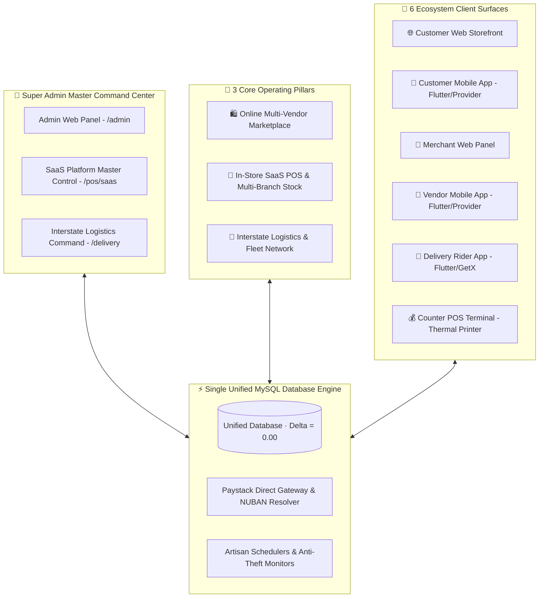

# 🛒 Victorious MARKET (Vmarket) — Omnichannel Commerce & SaaS POS Ecosystem

<div align="center">


**Victorious MARKET (Vmarket)** is a hyper-scalable, zero-trust omnichannel commerce ecosystem and retail operating system. It seamlessly unifies **online multi-vendor e-commerce**, **in-store SaaS point-of-sale (POS & inventory management)**, and **interstate logistics fleet operations** into a single shared database engine.

</div>

---

## 🏛️ Grand Vision & Core Architecture

Victorious MARKET is engineered to eliminate the disconnect between physical store operations and online selling. Instead of merchants maintaining isolated third-party softwares for physical checkout and online storefronts, **Vmarket provides one single source of truth (SSOT)**:



---

## 🎨 Official Brand Identity & Palette System

Every visual surface, Blade template, mobile app, and POS register adheres strictly to the official Victorious MARKET brand palette:

* 🟣 **Primary Brand Purple (`#5E17EB`)**: Vibrant Royal Purple used for main navigation, action buttons, active tab indicators, and brand headers.
* 🟡 **Secondary Brand Gold (`#FFD700`)**: Electric Gold used for VIP badges, promotional highlights, star ratings, and discount pills.
* ⚪ **Base Clean White (`#FFFFFF`)**: Pure White used for card backgrounds, high-contrast typography, and modal surfaces.
* 🇳🇬 **Official Currency**: Nigerian Naira (`NGN` / `₦`) formatted with precision atomic ledger balancing.

---

## 👑 Centralized Single Super Admin Governance

Across the entire platform, there is **only ONE authoritative Super Admin identity** (`auth:admin` where `admin_role_id = 1`):
- **Super Admin Exclusive Access**: Platform command center, SaaS subscription monetization, tenant on-boarding radar, system audit logs, and global configuration.
- **1-Click Header Access**: The Super Admin dashboard provides instant, one-click access to both **`POS Hub`** and **`Delivery Hub`** directly from the topbar header.
- **Tenant & Role Isolation**: Zero cross-tenant data bleed. Merchants and cashiers are strictly scoped to their assigned `seller_id` and `shop_id`.

---

## 🏢 Platform Topology & Directory Mapping

The codebase is organized as a high-performance monorepo:

| Component | Monorepo Directory | Technology Stack | State / Pattern | Core Purpose |
| :--- | :--- | :--- | :--- | :--- |
| **Unified Web & REST Backend** | [`backend/vmarket-web/`](file:///c:/Users/USER/Downloads/vmarket/backend/vmarket-web) | Laravel 10, PHP 8.1+, MySQL | MVC, Repository Pattern, Eloquent | Marketplace REST APIs, Admin Panel, Vendor Panel, Customer Storefront, and Integrated POS Module. |
| **Hysam POS SaaS Module** | [`backend/vmarket-web/Modules/Pos/`](file:///c:/Users/USER/Downloads/vmarket/backend/vmarket-web/Modules/Pos) | Laravel Modular (Blade, Alpine, CSS) | Multi-Guard (`admin`, `seller`, `vendor_employee`) | 17 operational retail modules: Counter POS, Stock Transfers, Debt Ledgers, Wholesale Desk, SaaS Master Control. |
| **Customer Mobile App** | [`User app/`](file:///c:/Users/USER/Downloads/vmarket/User%20app) | Flutter 3.x, Dart | **Provider** + `flutter_secure_storage` | B2C Online Shopping, live order tracking, wallet, Paystack digital payments. |
| **Merchant Mobile App** | [`Vendor app/`](file:///c:/Users/USER/Downloads/vmarket/Vendor%20app) | Flutter 3.x, Dart | **Provider** + `flutter_secure_storage` | Merchant catalog, stock management, sales metrics, and payout requests. |
| **Delivery Rider Mobile App** | [`Delivery Man App/`](file:///c:/Users/USER/Downloads/vmarket/Delivery%20Man%20App) | Flutter 3.x, Dart | **GetX** + `flutter_secure_storage` | Dispatch rider route navigation, pickup OTP handoffs, doorstep cash collection. |

---

## 🧮 All 17 Integrated Hysam In-Store POS & SaaS Modules

All 17 modules from the original Hysam SaaS product are embedded directly into the unified platform at [`/pos`](http://127.0.0.1:8000/pos):

```
├── 1.  Executive KPI Dashboard        (/pos, /pos/dashboard)
├── 2.  Visual POS Counter Terminal    (/pos/terminal) — Barcode scanner, split-tender, 80mm thermal receipts
├── 3.  Products & Pricing Catalog     (/pos/products) — Bulk CSV/JSON import/export, master price edits
├── 4.  Multi-Branch Stock Hub         (/pos/stock) — Goods-in receiving, stock cards, inventory logs
├── 5.  Shop Transfers & Waybills      (/pos/stock/transfers, /pos/stock/waybill/{id}) — Inter-branch logistics
├── 6.  Pickup Orders Holding Buffer   (/pos/stock/unsupplied) — Fulfillment staging queue
├── 7.  Damaged Goods & Scrap Ledger   (/pos/stock/adjustments) — Inventory loss write-offs
├── 8.  Multi-Tab Transaction Ledgers  (/pos/transactions) — Shift logs, sales history, audit exports
├── 9.  Customer Debt Aging Buckets    (/pos/debts) — 0-7, 8-30, 30+ day aging, part-payment recovery
├── 10. Dedicated Wholesale Desk       (/pos/wholesale, /pos/wholesale/invoice/{id}) — Commercial invoices
├── 11. Auditor Anti-Theft Radar       (/pos/auditor) — Variance detection, physical vs allocated discrepancies
├── 12. Reports & AI Data Exports      (/pos/reports) — P&L analytics, JSON/CSV exports
├── 13. Workers & Permission Roles     (/pos/users) — Cashier, storekeeper, manager permission boundaries
├── 14. System Settings & Branches     (/pos/settings) — Multi-store configuration, receipt footers
├── 15. Plan & Subscription Billing    (/pos/subscription) — Paystack billing portal, tier upgrades
├── 16. SaaS Platform Master Control   (/pos/saas) — Platform MRR, merchant tenant roster, live stream
└── 17. User Guide & Training Center   (/pos/help) — Built-in POS keyboard shortcuts and FAQs
```

---

## 🚚 Interstate Logistics & Fleet Command Hub

The platform includes a dedicated logistics operations hub at [`/delivery`](http://127.0.0.1:8000/delivery):
- **37 State Regional Hubs**: Logistics routing across all 36 Nigerian states and FCT Abuja.
- **Corridor Routes & Transit Matrices**: Inter-city transit route mapping and dispatch scheduling.
- **Fleet & Courier Registry**: Vehicle asset management and courier rider assignments.
- **Batch Shipments & Waybills**: Consolidated manifests for interstate cargo distribution.
- **Cash on Delivery (COD) Remittance**: Automated reconciliation of rider doorstep collections.

---

## 🛡️ Enterprise Security & Financial Invariants

1. **Zero-Trust Multi-Guard Authentication**: Explicit guard separation (`auth:admin`, `auth:seller`, `auth:vendor_employee`, `auth:customer`, `auth:delivery_man`).
2. **Pessimistic Balance & Row-Level Locking**: All read-modify-write operations on customer wallets, merchant balances, and cash drawers execute inside `DB::transaction()` with `->lockForUpdate()`.
3. **Double-Execution Prevention**: Payment webhooks and digital callbacks enforce atomic row updates (`where('is_paid', 0)->update(...)`) before invoking order fulfillment hooks.
4. **Universal 6-Digit OTP Protocol**: Cryptographic 6-digit OTP verification with 15-minute expiration and 5-attempt brute-force rate limiting.
5. **Anti-Mass-Assignment Protection**: All model mutations strictly use `$request->only(...)` or dedicated FormRequest data mappers.

---

## 🚀 Quick Start & Local Execution

### 1. Start the Unified Backend & POS Server
```bash
cd backend/vmarket-web
php -S 127.0.0.1:8000 -t public
```

### 2. Access the Ecosystem Surfaces
- **Customer Web Storefront**: [http://127.0.0.1:8000](http://127.0.0.1:8000)
- **Super Admin Command Center**: [http://127.0.0.1:8000/login/admin](http://127.0.0.1:8000/login/admin)
  - *Default Demo Credentials*: `admin@admin.com` / `12345678`
- **Merchant Web Portal**: [http://127.0.0.1:8000/vendor/auth/login](http://127.0.0.1:8000/vendor/auth/login)
  - *Default Demo Credentials*: `test.vendor@vmarket.com` / `12345678`
- **In-Store POS & SaaS Hub**: [http://127.0.0.1:8000/pos](http://127.0.0.1:8000/pos)
- **POS Counter Register (Terminal)**: [http://127.0.0.1:8000/pos/terminal](http://127.0.0.1:8000/pos/terminal)
- **Logistics & Fleet Command**: [http://127.0.0.1:8000/delivery](http://127.0.0.1:8000/delivery)

### 3. Run Automated Ecosystem Health Tests
```bash
# Run 100+ comprehensive views & API test harness
php test_100_plus_ecosystem_views_and_apis_suite.php
```

---

## 📜 AI Development & Contribution Rules

All AI assistants and developers contributing to this monorepo must strictly adhere to [AGENTS.md](file:///c:/Users/USER/Downloads/vmarket/.agents/AGENTS.md):
- **Document Changes**: Every feature, bug fix, or optimization must be logged in [AI_CHANGELOG.md](file:///c:/Users/USER/Downloads/vmarket/AI_CHANGELOG.md).
- **Brand Palette Adherence**: Strictly use `#5E17EB` (Primary Purple), `#FFD700` (Secondary Gold), and `#FFFFFF` (White).
- **Atomic Git Commits**: Include `[AI]` attribution tag in all commits (e.g. `feat(pos): integrate authentic Hysam modules [AI]`).
- **Mathematical Invariant Proof ($\Delta = 0.00$)**: All financial and ledger operations must prove zero balance drift.
