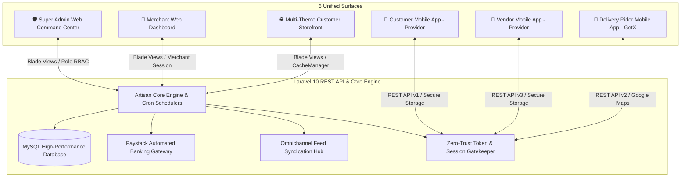

# 🛒 Victorious MARKET (VMarket) — Institutional Operating Platform

<div align="center">


**"Your Trusted Online Market For Quality Products"**

</div>

---

## 🏛️ What Victorious MARKET Actually Is

Victorious MARKET (VMarket) is **not simply an online shop**, and **not simply a generic marketplace plugin**. 

> **Victorious MARKET is a controlled marketplace + in-house merchant + delivery operator + settlement platform, starting locally in Uyo Local Government Area (LGA) and expanding systematically LGA by LGA.**

Rather than attempting to conquer all of Nigeria on day one, VMarket is engineered as a disciplined, hyper-localized commercial operating company. The platform maintains total institutional control over the customer transaction, merchant verification standards, centralized logistics dispatch, and vendor financial settlements.

```
                         VICTORIOUS MARKET (VMarket)
                                     │
                 ┌───────────────────┴───────────────────┐
                 │                                       │
          VMarket Itself                           Verified Vendors
       (In-House Merchant)                               │
                                                        LGA
                                                         │
                                               1 or More Approved
                                                 Pickup Points
```

---

## 🏢 The 5 Core Businesses Under One System

Victorious MARKET integrates five operational businesses into a single unified technological architecture:

| # | Business Domain | Operating Description | Institutional Control |
|---|---|---|---|
| **1** | **Marketplace Operator** | Connects consumers with verified local merchants offering fixed, non-negotiable retail prices. | Super Admin & Merchant Governance |
| **2** | **In-House Merchant** | VMarket procures, warehouses, and retails its own inventory directly on the platform. | Merchandising & Inventory Operations |
| **3** | **Logistics & Delivery Operator** | Operates a centralized dispatch fleet, intra-city routes, and regional motor park transit hubs. | Dispatch Operations & Rider Fleet |
| **4** | **Payment & Settlement Platform** | Holds 100% of customer funds in escrow, calculates splits via BCMath, and manages vendor payouts. | Platform Treasury & Reconciliation |
| **5** | **Customer Loyalty System** | Rewards shoppers with 5% merchandise cashback funded strictly from VMarket's own commission. | Customer Reward Ledger |

---

## 💰 The Core Commercial Model: 90 / 5 / 5 Split

Victorious MARKET enforces a transparent, mathematically proven ($\Delta = \text{₦}0.00$) revenue split on all merchandise:

```
                          100% Merchandise Total
                                    │
             ┌──────────────────────┴──────────────────────┐
             ▼                                             ▼
        90% to Vendor                                10% to VMarket
       (Guaranteed Net)                                    │
                                            ┌──────────────┴──────────────┐
                                            ▼                             ▼
                                    5% Customer Cashback          5% VMarket Retained
                                      (Reward Ledger)               (Net Platform)
```

### Commercial Partitioning Example (₦100,000 Sale)

| Allocation Beneficiary | Percentage | Exact Amount | Financial Source |
|---|:---:|---:|---|
| **Verified Merchant** | **90%** | **₦90,000** | Merchandise Principal |
| **Customer Cashback Allocation** | **5%** | **₦5,000** | VMarket 10% Commission |
| **VMarket Retained Revenue** | **5%** | **₦5,000** | VMarket 10% Commission |
| **Total Merchandise** | **100%** | **₦100,000** | Mathematical Invariant ($\Delta = \text{₦}0.00$) |

> **Non-Negotiable Rule:** The 5% customer cashback comes **entirely out of VMarket's 10% commission**, never out of the vendor's 90%. Vendors are always paid their full 90%.

### Absolute Separation of Delivery Fees from Merchandise Money
Delivery fees are **100% segregated** from merchandise revenue. Delivery fees are never factored into vendor commission calculations:
- **Product Price:** ₦100,000
- **Delivery Fee:** ₦2,000
- **Customer Pays:** ₦102,000
  - **Merchandise Ledger (₦100,000):** Vendor ₦90,000 \| Cashback ₦5,000 \| VMarket ₦5,000
  - **Logistics Ledger (₦2,000):** 100% allocated to VMarket delivery and dispatch operations.

---

## 🛍️ The Customer Experience: Two Distinct Fulfillment Paths

Customers enjoy a seamless digital storefront that branches cleanly at checkout into two specialized fulfillment workflows:

```
                            Browse Catalog
                                  │
                          Select Product(s)
                                  │
                             Add to Cart
                                  │
                              Checkout
                                  │
                  ┌───────────────┴───────────────┐
                  ▼                               ▼
            DOORSTEP DELIVERY               IN-SHOP PICKUP
         (Pay First, Ship Later)       (Inspect First, Pay Later)
```

### 1. Centralized Doorstep Delivery
- **VMarket-Controlled Fleet:** Vendors do not handle shipping. VMarket motorized dispatch riders collect orders directly from vendor shops and deliver to the customer's doorstep or designated regional transit park.
- **Logistics Privacy:** Unit prices, wholesale purchase costs, and vendor commission splits are 100% masked from delivery riders.

### 2. The In-Shop Pay-After-Inspection Pickup Engine
A transformative retail flow engineered for high-trust African commerce:
1. **Browse & Reserve:** Customer creates an online pickup reservation for a specific vendor and approved pickup point.
2. **Zero Inventory Hold:** Reservations do **not** lock or freeze merchant stock. Physical shop inventory remains the single source of truth.
3. **Visit & Inspect:** Customer visits the approved pickup point and presents a **Reservation Code** (`RES-XXXXXXXX`).
4. **Physical Examination:** Vendor staff retrieves the item; the customer inspects physical condition and authenticity.
5. **Accept & Pay:** If satisfied, the vendor marks the item as accepted on the Vendor Portal, unlocking digital payment. The customer pays VMarket via Paystack.
6. **Handover OTP Verification:** Verified payment creates the Order and generates a separate 6-digit cryptographic **Handover OTP**. Vendor enters the OTP to complete final release of the goods.

$$\text{Reservation Code (Inspect)} \neq \text{Handover OTP (Release)}$$

---

## ⏳ The 24-Hour Return Window & Cashback Maturation

Cashback is not disbursed immediately upon payment. It matures safely through an operational return buffer:

```
Order Delivered OR Handover Completed
                │
     24-Hour Return/Refund Window Begins
                │
      Are there dispute claims?
       ├── YES: Cashback held / quarantined during dispute resolution
       └── NO:  Window passes with zero claims
                │
     5% Cashback Matures to "Available" in Customer Reward Ledger
```

Every order tracks four immutable audit timestamps:
* `paid_at`: Gateway capture confirmation.
* `received_at`: Customer physical receipt or pickup handover timestamp.
* `refund_window_expires_at`: Exactly `received_at + 24 hours`.
* `cashback_eligible_at`: Timestamp when rewards become redeemable.

---

## 🏪 The Vendor Operating Model

* **LGA-Anchored Vendors:** A vendor is modeled as an accredited merchant operating within a specific LGA with one or more pre-approved physical pickup points.
* **Approved Pickup Points:** Pre-inspected physical retail locations where shoppers can collect orders. In V1, pickup points do not require independent accounting branch complexity, keeping financial auditing lean and reliable.
* **Vendor Privacy:** Vendors' private residences are strictly protected; only accredited, customer-accessible pickup points are displayed.
* **Fixed, Non-Negotiable Pricing:** Products must have clear, visible prices. No "DM for price," no WhatsApp haggling.
* **7-Day Marketplace Freshness:** Merchants must confirm marketplace listing freshness every 7 days (configurable by Admin). Stale listings become unlisted automatically.

---

## 👥 Two Segregated Employee Populations (RBAC)

Victorious MARKET enforces absolute separation between merchant staff and platform staff:

```
  VENDOR EMPLOYEES                          VMARKET PLATFORM EMPLOYEES
  (Affiliated with a specific Vendor)       (Directly employed by VMarket)
  ├── Vendor Owner                          ├── Super Admin Command Center
  ├── Vendor Manager                        ├── Logistics & Dispatch Operators
  ├── Sales Staff                           ├── Platform Field Inspectors
  └── Pickup Staff                          └── Treasury & Financial Auditors
```

* **Vendor Staff Boundary:** Cannot access VMarket platform finances, delivery fleet tracking, or competitor sales data.
* **VMarket Staff Boundary:** Operates under strict Role-Based Access Control (RBAC) to govern compliance, logistics, and dispute arbitration.

---

## 🗺️ Geographic Phased Scaling Strategy

VMarket is architected to scale without structural software re-engineering:

```
  PHASE 1: Uyo LGA Core (Active)
  • Verified Uyo merchants & accredited pickup points
  • VMarket hyper-local intra-Uyo motorcycle dispatch
  • 90/5/5 financial engine with manual treasury settlement

  PHASE 2: Akwa Ibom Transit Parks
  • Connect Uyo hub to intra-state motor parks (Ikot Ekpene, Eket, Oron)
  • Park-to-park secure waybill package transfers

  PHASE 3: Regional Inter-State Parks
  • Connect Uyo central logistics to commercial transit parks (Calabar, Port Harcourt, Aba)
  • Syndicate inter-state verified merchant catalogs

  PHASE 4: Sequential LGA Rollouts
  • Activate contiguous LGAs sequentially (Abak, Ikot Ekpene, Eket)
  • New LGAs plug directly into the established delivery, escrow, and settlement pipeline
```

---

## 🏗️ Ecosystem Topology & Client Surfaces

The platform consists of **1 unified Laravel 10 Core Engine** and **3 Native Flutter Mobile Applications** operating across 6 synchronized surfaces:



| Component | Path | Stack | State / Architecture | Operational Purpose |
| :--- | :--- | :--- | :--- | :--- |
| **Backend & Web Panels** | [`backend/vmarket-web/`](file:///c:/Users/SOOQ%20ELASER/Downloads/vmarket/backend/vmarket-web) | Laravel 10, PHP 8.1+, MySQL | MVC, Repository Pattern, Eloquent | Core REST API, Super Admin Command Center, Vendor Web Portal, and Storefront views. |
| **Customer App** | [`User app/`](file:///c:/Users/SOOQ%20ELASER/Downloads/vmarket/User%20app) | Flutter 3.x, Dart | **Provider** + `flutter_secure_storage` | B2C shopping: search, cart, pickup reservation, Paystack checkout, live order tracking. |
| **Vendor App** | [`Vendor app/`](file:///c:/Users/SOOQ%20ELASER/Downloads/vmarket/Vendor%20app) | Flutter 3.x, Dart | **Provider** + `flutter_secure_storage` | Merchant POS & operations: reservation verification, physical inspection sign-off, order fulfillment. |
| **Delivery Rider App** | [`Delivery Man App/`](file:///c:/Users/SOOQ%20ELASER/Downloads/vmarket/Delivery%20Man%20App) | Flutter 3.x, Dart | **GetX** + `flutter_secure_storage` | Dispatch rider terminal: turn-by-turn navigation, vendor pickup OTP verification, doorstep delivery OTP validation. |

---

## 🛡️ Enterprise Security & Mathematical Invariants

1. **Mathematical Invariant Proofs ($\Delta = \text{₦}0.00$):** All financial computations use BCMath arbitrary precision strings (`bcadd`, `bcsub`, `bcmul`, `bcdiv`, `bccomp`). Floating-point arithmetic is strictly forbidden in financial paths.
2. **Pessimistic Balance & Stock Concurrency:** All inventory deductions and financial ledger mutations execute inside atomic transactions (`DB::transaction()`) with pessimistic row-level locks (`->lockForUpdate()`).
3. **Atomic Payment Locks:** All payment gateway webhooks enforce atomic row-level locks (`where('is_paid', 0)->update(...)`) with double-execution guards (`$affected > 0`) to prevent duplicate order generation.
4. **Universal 6-Digit OTP:** Handover codes, bank detail modification locks, and password resets use cryptographically secure 6-digit integers (`rand(100000, 999999)`) with 15-minute expiration bounds and 5-attempt rate-limiting lockouts.
5. **Zero-Trust IDOR Authorization:** Every API endpoint rigorously verifies principal ownership (`customer_id`, `seller_id`, or `admin_id`).

---

## 🎨 Branding & Visual Identity

* **Victorious Deep Purple (`#6C2A8A` / `#4A148C`)**: Symbolizing sovereign authority, security, and elegance.
* **Victorious Gold (`#FDB913` / `#FFD700`)**: Symbolizing prosperity, commerce, and excellence.
* **Official Currency**: Nigerian Naira (`NGN` / `₦`) with exact kobo precision.

---

## 📜 Governance & Authoritative Documentation

* **V1 Master Business Rulebook (42 Rules):** [`V1_BUSINESS_RULEBOOK.md`](file:///c:/Users/SOOQ%20ELASER/Downloads/vmarket/V1_BUSINESS_RULEBOOK.md)
* **Operating Company Model Blueprint:** [`OPERATING_COMPANY_MODEL.md`](file:///c:/Users/SOOQ%20ELASER/Downloads/vmarket/OPERATING_COMPANY_MODEL.md)
* **Mathematical & Systemic Proof Invariants:** [`VICTORIOUS_MARKET_MATHEMATICAL_AND_SYSTEMIC_PROOF.md`](file:///c:/Users/SOOQ%20ELASER/Downloads/vmarket/VICTORIOUS_MARKET_MATHEMATICAL_AND_SYSTEMIC_PROOF.md)
* **Engineering Directives & Architecture:** [`AI_ENGINEERING_RULES.md`](file:///c:/Users/SOOQ%20ELASER/Downloads/vmarket/AI_ENGINEERING_RULES.md) \| [`ARCHITECTURE.md`](file:///c:/Users/SOOQ%20ELASER/Downloads/vmarket/ARCHITECTURE.md)
* **Chronological AI Modifications:** [`AI_CHANGELOG.md`](file:///c:/Users/SOOQ%20ELASER/Downloads/vmarket/AI_CHANGELOG.md)

---

<div align="center">
  <sub>Victorious MARKET — Built with pride. Operated with precision. Governed with integrity.</sub>
</div>
