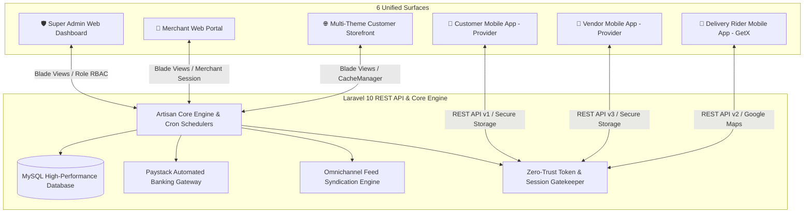

# 🛒 Victorious MARKET (Vmarket) — Unified E-Commerce Ecosystem

<div align="center">


**Victorious MARKET (Vmarket)** is a hyper-scalable, zero-trust multi-vendor e-commerce platform engineered specifically for the dynamic retail, multi-channel marketing, and logistics realities of the Nigerian and West African digital economy.

</div>

---

## 🏛️ Executive Summary & Core Identity

Victorious MARKET is built on a **Zero-Trust Backend Architecture** with **Unified Multi-Platform Synchronization**. The ecosystem connects consumers, verified merchants, and motorized dispatch riders seamlessly through real-time telemetry, automated Paystack banking reconciliations, fraud-proof logistics handoffs, and omnichannel catalog syndication.

### Primary Color Scheme & Branding
* **Victorious Deep Purple (`#4A148C` / `#6C2A8A`)**: Symbolizing authority, security, and elegance.
* **Victorious Gold (`#FDB913` / `#FFD700`)**: Symbolizing prosperity, commerce, and excellence.
* **Currency**: Nigerian Naira (`NGN` / `₦`) with precision rounding and atomic ledger balancing.

---

## 🏗️ Ecosystem Topology & Service Layers

The platform consists of **1 unified Laravel 10 Backend** and **3 Native Flutter Mobile Applications** operating with zero architectural drift:



| Component | Path | Stack | Architecture / State | Purpose |
| :--- | :--- | :--- | :--- | :--- |
| **Backend & Web Panels** | [`backend/vmarket-web/`](file:///c:/Users/USER/Downloads/vmarket/backend/vmarket-web) | Laravel 10, PHP 8.1+, MySQL | MVC, Repository Pattern, Eloquent | Central REST API, Super Admin Panel, Vendor Web Portal, and Storefront views. |
| **Customer App** | [`User app/`](file:///c:/Users/USER/Downloads/vmarket/User%20app) | Flutter 3.x, Dart | **Provider** + `flutter_secure_storage` | B2C shopping: search, wishlist, cart, Paystack checkout, live order tracking. |
| **Vendor App** | [`Vendor app/`](file:///c:/Users/USER/Downloads/vmarket/Vendor%20app) | Flutter 3.x, Dart | **Provider** + `flutter_secure_storage` | Merchant POS & operations: catalog, pricing updates, sales analytics, and payout tracking. |
| **Delivery Rider App** | [`Delivery Man App/`](file:///c:/Users/USER/Downloads/vmarket/Delivery%20Man%20App) | Flutter 3.x, Dart | **GetX** + `flutter_secure_storage` | Dispatch rider terminal: map navigation, package pickup OTP verification, and Paystack remittance. |

---

## 🌟 Flagship Innovations & Capabilities

### 1. 🛡️ Merchant Identity (KYC) & Bank Security Shield
* **Real-Time NUBAN Bank Resolution**: Integrates with Paystack to resolve official bank account holder names instantly upon entering a 10-digit NUBAN.
* **Fuzzy String Matching Algorithm**: Automatically scores the resolved bank name against the vendor's personal name and registered business name (filtering corporate noise words like `LTD`, `PLC`, `ENTERPRISES`).
* **48-Hour Bank Cooldown Lock**: Any modification to vendor bank payout details triggers a cryptographic 6-digit email OTP and initiates an automated **48-hour withdrawal cooldown** to prevent account takeover theft.
* **Mandatory Payout Receipts**: Super Admin must attach transaction receipt screenshots for all withdrawal approvals, viewable directly by vendors inside their apps.

### 2. ⏳ 30-Day Product Price Auto-Expiry & Deactivation Engine
* **Inflation & Price Staleness Protection**: In fast-moving economic environments, unupdated vendor prices cause merchant cancellations and customer dissatisfaction.
* **Daily Automated Scheduler (`php artisan products:check-price-expiry`)**:
  * **Day 25 (Warning)**: Sends high-priority push notifications and emails to vendors to review and confirm prices.
  * **Day 30 (Deactivation)**: Sets `status = 0` and `deactivation_reason = 'price_expired'`, clearing storefront caches immediately.
* **Instant Vendor Reactivation**: Vendors update their prices with a single tap in the Vendor App or Web Portal (`/api/v3/seller/products/update-price-and-reactivate`) to instantly restore products to the live storefront.

### 3. 🌐 Omnichannel Live Product Feed Export Hub
* **Google Merchant Center (Google Shopping RSS 2.0 XML)**: Live URL feed (`/api/v1/products/feed/google-merchant.xml?token=...`) formatted to Google DTD specifications with `<g:id>`, `<g:title>`, `<g:price>`, `<g:sale_price>`, `<g:availability>`, and `<g:brand>`.
* **Meta Commerce Manager (Facebook & Instagram Catalog CSV)**: Live automated CSV data feed (`/api/v1/products/feed/facebook-catalog.csv?token=...`) allowing daily automatic catalog sync for dynamic retargeting ads and Instagram Shopping tags.
* **TikTok Shop Catalog Feed**: Standardized catalog CSV (`/api/v1/products/feed/tiktok-catalog.csv?token=...`).
* **Token-Protected Security**: Secret feed tokens prevent web scrapers while allowing authorized platform crawlers uninterrupted access.

### 4. 🛵 Delivery Rider Financial Privacy & Package Security
* **Rider Privacy Protection**: Unit prices, purchase costs, merchant markups, discounts, and delivery commission splits are **100% zeroed out** in rider API payloads.
* **Clear Doorstep Collection Card**:
  * **Prepaid Orders**: Displays `₦0.00 (Prepaid - Do Not Collect Cash)`.
  * **Cash on Delivery**: Displays the exact collection total with clear doorstep payment handling (Cash or Paystack QR/link).
* **Package Handoff OTP**: Riders must enter a unique verification code upon arriving at a vendor's shop to confirm physical custody of goods.

### 5. 💳 Self-Serve In-App Paystack Cash Remittance
* **Frictionless Remittance**: Riders can remit collected cash-in-hand directly to the platform via Paystack (Bank Transfer, Debit Card, USSD) inside the Delivery App.
* **Instant Automated Reconciliation**: Backend webhooks atomically deduct `cash_in_hand`, record an audit transaction log (`type: cash_collect_by_admin`), and notify the rider.

### 6. 🔒 Atomic Payment Row Locking (Zero-Trust)
* **Atomic Row-Level Database Locks**: All 13 payment gateway controllers enforce `where('is_paid', 0)->update(...)` locks with double-execution guards (`$affected > 0`) before executing digital payment fulfillment hooks, eliminating race conditions, double order generation, and duplicate wallet credits.

### 7. 💬 Order-Bound Communication Gating
* **Order-Lifecycle Gating**: Messaging threads exist strictly around active `order_id`s and automatically lock when an order is completed (`delivered`, `canceled`, `returned`).
* **Prohibition of Direct Customer-Vendor Chat**: Direct Customer $\longleftrightarrow$ Vendor chats are blocked at the database and controller level with `HTTP 403 Forbidden` to protect platform disintermediation.

---

## 🛠️ Tech Stack & Engineering Standards

```
Backend:          Laravel 10.x | PHP 8.1+ | MySQL 8.0+ | Composer 2.x
Caching & Search: Redis / Database Cache | Custom CacheManagerTrait
Frontend Web:     Blade | HTML5 | CSS3 | Vanilla JS (Zero Tailwind Bloat)
Mobile (User):    Flutter 3.x | Dart 3.x | Provider | GetIt | SecureStorage
Mobile (Vendor):  Flutter 3.x | Dart 3.x | Provider | GetIt | SecureStorage
Mobile (Rider):   Flutter 3.x | Dart 3.x | GetX | GetIt | SecureStorage
Payments:         Paystack (Primary NGN) | Flutterwave | Stripe | PayPal | Razorpay
Code Quality:     100% PSR-12 Compliant | 0 Syntax Errors | 0 Flutter Lint Errors
```

---

## 🚀 Deployment & Operations

### 1. Backend Server Setup
```bash
# Navigate to web backend directory
cd backend/vmarket-web

# Install production dependencies
composer install --no-dev --optimize-autoloader

# Run database migrations
php artisan migrate --force

# Clear and optimize framework caches
php artisan optimize:clear
php artisan config:cache
php artisan route:cache
php artisan view:cache
```

### 2. Scheduled Cron Jobs (`crontab -e`)
Add the Laravel scheduler cron to execute price expiry checks and cache warmers:
```bash
* * * * * cd /path-to-vmarket-web && php artisan schedule:run >> /dev/null 2>&1
```

### 3. Mobile Applications Build
```bash
# Customer App
cd "User app" && flutter pub get && flutter build apk --release

# Vendor App
cd "Vendor app" && flutter pub get && flutter build apk --release

# Delivery Rider App
cd "Delivery Man App" && flutter pub get && flutter build apk --release
```

---

## 📜 AI Changelog & Governance

All engineering modifications, security audits, and architectural decisions are tracked chronologically in [`AI_CHANGELOG.md`](file:///c:/Users/USER/Downloads/vmarket/AI_CHANGELOG.md). All AI agents must adhere strictly to the engineering directives in [`AGENTS.md`](file:///c:/Users/USER/Downloads/vmarket/.agents/AGENTS.md) and [`AI_ENGINEERING_RULES.md`](file:///c:/Users/USER/Downloads/vmarket/AI_ENGINEERING_RULES.md).

---

<div align="center">
  <sub>Built with pride for the Victorious MARKET ecosystem. Powered by rigorous engineering and zero-trust security.</sub>
</div>
