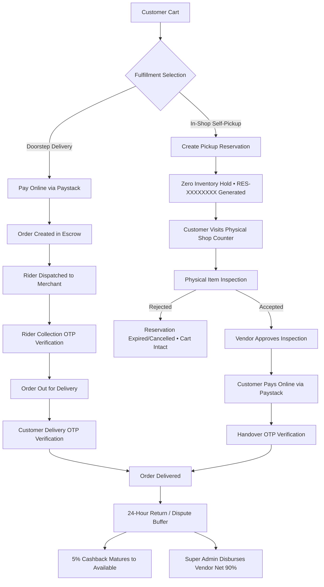

# 🛒 Victorious MARKET (VMarket) — Institutional Operating Platform

<div align="center">


**"Your Trusted Online Market For Quality Products"**

</div>

---

## 🏛️ 1. Executive Overview & System Topology

**Victorious MARKET (VMarket)** is an institutional-grade, multi-actor commerce and logistics operating platform designed specifically for high-trust African commerce. Rather than functioning as an unmoderated classifieds board or generic e-commerce template, VMarket operates as a **disciplined commercial company** providing:

1. **Controlled Multi-Vendor Marketplace:** Fixed, non-negotiable retail prices from accredited local merchants.
2. **In-House Retail Operator:** Direct procurement, warehousing, and fulfillment of platform-managed flagship items.
3. **Integrated Logistics & Dispatch Carrier:** Centralized intra-city motorcycle dispatch and regional motor park transit waybills.
4. **Automated Escrow & Treasury Settlement Engine:** 100% escrow protection with mathematical financial conservation ($\Delta = \text{₦}0.00$).
5. **Customer Loyalty System:** A 5% merchandise cashback rewards ledger funded strictly from platform commission.

```
                                  VICTORIOUS MARKET (VMarket)
                                               │
                   ┌───────────────────────────┴───────────────────────────┐
                   │                                                       │
         Platform Flagship                                     Accredited Merchants
     (In-House VMarket Inventory)                                          │
                   │                                          Canonical Nigerian Geography
                   │                                            (Country → State → LGA)
                   │                                                       │
                   └───────────────────────────┬───────────────────────────┘
                                               │
                                     Fulfillment Engine
                                ┌──────────────┴──────────────┐
                                ▼                             ▼
                        DOORSTEP DELIVERY              IN-SHOP PICKUP
                     (Pay First, Ship Later)      (Inspect First, Pay Later)
                                │                             │
                     Centralized Rider Fleet        Physical Counter Check
                     (Dual Custody OTP Handshake)   (RES-Code → Verification OTP)
```

---

## 💰 2. Core Commercial Model: The 90 / 5 / 5 Invariant

Victorious MARKET enforces a mathematically rigid revenue split on all merchandise transactions. Every monetary computation is calculated via arbitrary-precision string arithmetic (**BCMath**), strictly barring IEEE 754 floating-point inaccuracies.

```
                           100% Total Merchandise Value
                                         │
                 ┌───────────────────────┴───────────────────────┐
                 ▼                                               ▼
            90% to Vendor                                  10% to VMarket
         (Guaranteed Merchant Net)                               │
                                                 ┌───────────────┴───────────────┐
                                                 ▼                               ▼
                                       5% Customer Cashback             5% VMarket Retained
                                      (Customer Reward Ledger)         (Net Operating Margin)
```

### Partitioning Matrix (₦100,000 Merchandise Sale)

| Allocation Beneficiary | Ratio | Exact Amount | Financial Source & Accounting Rule |
| :--- | :---: | :---: | :--- |
| **Accredited Merchant** | **90%** | **₦90,000.00** | Net merchandise payout. Guaranteed and never diluted by customer rewards. |
| **Customer Cashback Allocation** | **5%** | **₦5,000.00** | Funded entirely out of VMarket's 10% commission. Matures post-return window. |
| **VMarket Retained Margin** | **5%** | **₦5,000.00** | Retained net platform revenue for operating reserves and server operations. |
| **Total Merchandise** | **100%** | **₦100,000.00** | $\Delta = \text{₦}0.000000$ (Zero Float Drift Guaranteed) |

### Strict Segregation of Logistics & Delivery Fees
Delivery fees are **100% segregated** from merchandise ledgers:
- **Merchandise Subtotal:** ₦100,000.00 *(subject to 90 / 5 / 5 split)*
- **Doorstep Delivery Fee:** ₦2,000.00 *(100% credited to logistics/rider dispatch accounts)*
- **Total Customer Remittance:** ₦102,000.00
- **Zero-Cross-Subsidization Rule:** Delivery fees are never used to pay merchant merchandise, nor are merchant margins deducted to cover shipping deficits.

---

## 🛍️ 3. Dual Fulfillment Lifecycle & Custody Handshakes


```mermaid
flowchart TD
    Cart[Customer Cart] --> Checkout{Fulfillment Selection}
    
    %% Doorstep Path
    Checkout -->|Doorstep Delivery| PayFirst[Pay Online via Paystack]
    PayFirst --> OrderCreated[Order Created in Escrow]
    OrderCreated --> DispatchRider[Rider Dispatched to Merchant]
    DispatchRider --> RiderPickupOTP[Rider Collection OTP Verification]
    RiderPickupOTP --> InTransit[Order Out for Delivery]
    InTransit --> CustomerDeliveryOTP[Customer Delivery OTP Verification]
    CustomerDeliveryOTP --> Delivered[Order Delivered]

    %% In-Shop Pickup Path
    Checkout -->|In-Shop Self-Pickup| CreateRes[Create Pickup Reservation]
    CreateRes --> NonHold[Zero Inventory Hold • RES-XXXXXXXX Generated]
    NonHold --> CounterVisit[Customer Visits Physical Shop Counter]
    CounterVisit --> Inspect[Physical Item Inspection]
    Inspect -->|Rejected| ReleaseRes[Reservation Expired/Cancelled • Cart Intact]
    Inspect -->|Accepted| VendorSignOff[Vendor Approves Inspection]
    VendorSignOff --> PayOnline[Customer Pays Online via Paystack]
    PayOnline --> HandoverOTP[Handover OTP Verification]
    HandoverOTP --> Delivered

    %% Post-Fulfillment
    Delivered --> ReturnWindow[24-Hour Return / Dispute Buffer]
    ReturnWindow --> Maturation[5% Cashback Matures to Available]
    ReturnWindow --> Settlement[Super Admin Disburses Vendor Net 90%]
```

### A. Centralized Doorstep Delivery
- **Fleet Governance:** Merchants do not manage independent drivers. Platform-vetted motorized delivery riders perform all pickups and drop-offs.
- **Directional Lane Pricing:** Delivery fees are determined dynamically by origin and destination LGAs via `DeliveryLane` database matrices.
- **Rider Privacy Protection:** Item wholesale costs, merchant profit margins, and platform splits are completely masked from delivery riders.
- **Cryptographic Delivery Codes:** 
  - Vendor $\to$ Rider parcel handover requires 6-digit `pickup_verification_code`.
  - Rider $\to$ Customer doorstep handover requires 6-digit `verification_code`.

### B. The In-Shop Pay-After-Inspection Engine
Designed to conquer low-trust consumer hesitation in high-value electronics and retail:
1. **Zero-Inventory-Hold Reservation:** Customer creates a pre-payment reservation. Physical counter inventory remains the single source of truth—no inventory locking or POS denial-of-service risk.
2. **Deterministic Code:** Generates collision-safe human-friendly code: `RES-XXXXXXXX`.
3. **Physical Inspection Window:** Dynamic hold window configured via Super Admin (`pickup_inspection_window_hours`, default 24h).
4. **Physical Inspection Sign-Off:** Customer inspects the item in person. Vendor marks reservation `inspected_accepted` on the portal.
5. **Digital Payment Unlock:** Paystack payment unlocks only after inspection passes.
6. **Separation of Custody Secrets:**
   $$\text{Reservation Code (Inspect)} \neq \text{Handover OTP (Release)}$$
   The reservation code permits inspection only; physical release of goods requires verified online payment and verification of the 6-digit `verification_code`.

---

## 🎁 4. Victorious Cashback & Return Maturation Engine

Cashback rewards are protected by an institutional return and dispute shield:

```
[Order Delivered / Handover]
           │
           ▼
  [24-Hour Return Window Begins]
           │
           ├─ Dispute Filed? ──► [Rewards Quarantined / Frozen Pending Arbitration]
           │
           └─ Zero Disputes Filed (Window Expires)
                     │
                     ▼
          [Cashback Status: Available] 
          (Redeemable at Checkout on Next Purchase)
```

- **Issuance Rule:** 5% of new money paid for eligible merchandise.
- **Spend Path:** Redeemable at checkout against merchandise total with atomic lock protection.
- **Expiry:** 365-day lifespan tracked in `customer_cashback_ledgers`.
- **Partial Refund Recalculation:** If an item is partially returned, the pending cashback reward is proportionally reduced against the retained merchandise value.

---

## 🛡️ 5. Unified Multi-Actor Push & In-Portal Notification Engine

The platform features a centralized multi-channel notification architecture covering all five ecosystem participant categories:

| Recipient Role | Key Event Triggers | Delivery Channel |
| :--- | :--- | :--- |
| **Online Shoppers** | `order_pending_message`, `order_confirmation_message`, `out_for_delivery_message`, `order_delivered_message`, `cashback_earned_message`, `pickup_reserved_message`, `pickup_inspected_accepted_message`, `pickup_completed_message`, `pickup_expired_message`, `order_waybill_generated_message` | Push (FCM), In-App Modal, SMS |
| **Accredited Merchants** | `new_order_message`, `new_pickup_reservation_message`, `pickup_reservation_expired_message`, `low_stock_alert_message`, `delivery_partner_assigned_message`, `withdraw_request_status_message` | Merchant Dashboard, Vendor App Push |
| **Delivery Riders** | `new_order_assigned_message`, `waybill_assigned_message`, `order_rescheduled_message`, `order_canceled` | Rider Mobile Terminal (GetX reactive alerts) |
| **Logistics Partners** | `order_dispatched_to_company`, `waybill_routed_to_company`, `rider_delivery_completed`, `company_withdrawal_status`, `rider_failed_delivery_alert` | In-Portal Notification Log, Email Fail-Safe |
| **Super Admin** | Settlement anomaly alerts, reconciliation mismatch notifications, KYC escalations | Command Center Real-Time Dashboard |

---

## 🗺️ 6. Canonical Geography & Phased Regional Scaling

To prevent geographic drift and shipping calculation corruption, the system enforces a strict 3-tier cascade:

$$\text{Country (Nigeria)} \longrightarrow \text{State (Akwa Ibom)} \longrightarrow \text{Local Government Area (LGA)}$$

```
  PHASE 1: Uyo LGA Core Anchor (Operational)
  • Uyo LGA (LGA ID: 69) headquarters & hub anchor
  • Intra-Uyo motorized dispatch fleet (₦500.00 standard lane)
  • Verified Uyo merchant pickup counters

  PHASE 2: Akwa Ibom Contiguous Regional Expansion
  • Directional transit lanes connecting Uyo Hub to:
    - Eket LGA (LGA ID: 52)
    - Ikot Ekpene LGA (LGA ID: 58)
    - Oron LGA (LGA ID: 67)
    - Abak LGA (LGA ID: 49)
  • Motor park transit waybills and regional partner waybill transfers

  PHASE 3: Inter-State Commercial Corridors
  • Secured regional transit waybills to commercial trading hubs:
    - Port Harcourt (Rivers State)
    - Aba (Abia State)
    - Calabar (Cross River State)
```

---

## 💻 7. Monorepo Architecture & Technology Stack

The repository is structured as a unified monorepo containing the central Laravel core and 3 production Flutter mobile applications:

```
vmarket/
├── backend/
│   └── vmarket-web/              # Laravel 10 Core Engine, API, & Admin Web Panels
│       ├── app/
│       │   ├── Http/Controllers/ # REST API Controllers & Admin Presentation
│       │   ├── Models/           # Eloquent Domain Models (Strict Fillable)
│       │   ├── Repositories/     # Eloquent Repositories (Eager-Loading Enforced)
│       │   ├── Services/         # Financial, Settlement, Cashback, & Pickup Engines
│       │   ├── Traits/           # PushNotificationTrait, CommonTrait
│       │   └── Utils/            # OrderManager, CartManager, Helpers
│       ├── database/
│       │   ├── migrations/       # Immutable Database Migrations
│       │   └── seeders/          # Geography, Lanes, Brands, & Notification Seeders
│       ├── resources/
│       │   ├── themes/           # Multi-Theme Storefront (theme_vmarket)
│       │   └── views/            # Super Admin & Merchant Presentation (Blade)
│       └── routes/               # API, Web, Vendor, Admin, & Logistics Routes
├── User app/                     # Customer Mobile Application (Flutter • Provider)
│   ├── lib/
│   │   ├── features/             # Feature-First Architecture
│   │   └── di_container.dart     # GetIt Service Locator & Dependency Registration
│   └── test/                     # Customer Fulfillment & Address Cascade Tests
├── Vendor app/                   # Merchant Mobile Application (Flutter • Provider)
│   ├── lib/
│   │   └── features/             # Merchant POS, Product, & Inspection Features
│   └── test/                     # Vendor Journey & Role Boundary Tests
├── Delivery Man App/             # Rider Mobile Application (Flutter • GetX)
│   └── lib/                      # Live GPS Tracking, Route Navigation, & OTP Handover
├── .agents/                      # Canonical Architecture Rules & API Contract Registry
├── AI_CHANGELOG.md               # Chronological AI Modifications Log
└── AI_ENGINEERING_RULES.md       # Foundational Engineering Principles & Invariants
```

### Technology Matrix

| Client Surface | Primary Technology | Architecture / State | Security & Storage |
| :--- | :--- | :--- | :--- |
| **Core Backend & REST API** | Laravel 10 / PHP 8.2+ | MVC + Repository Pattern | BCMath, Row Locks, Policies, Sanctum/Passport |
| **Super Admin Command Center** | Laravel Blade / Bootstrap 4 | Server-Side Presenter | Zero-Trust Server Gate Authorization |
| **Public Storefront** | Laravel Blade / Theme Engine | Multi-Theme (Default, Aster, Fashion) | Server-Rendered, WebP, CacheManager |
| **Customer Mobile App** | Flutter 3.x / Dart | **Provider** + Feature-First | `flutter_secure_storage`, GetIt |
| **Vendor Mobile App** | Flutter 3.x / Dart | **Provider** + Feature-First | `flutter_secure_storage`, Branch Isolation |
| **Delivery Rider App** | Flutter 3.x / Dart | **GetX** + Reactive Bindings | `flutter_secure_storage`, High-Precision GPS |

---

## 🔒 8. Non-Negotiable Financial & Security Invariants

1. **Mathematical Invariant Proofs ($\Delta = \text{₦}0.00$):** Every monetary computation uses BCMath arbitrary-precision string arithmetic (`bcadd`, `bcsub`, `bcmul`, `bcdiv`, `bccomp`). Floating-point arithmetic is strictly prohibited in financial paths.
2. **Pessimistic Balance & Stock Locks:** Ledger deductions and stock decrements execute inside atomic database transactions (`DB::transaction()`) using pessimistic row-level locks (`->lockForUpdate()`).
3. **Atomic Payment Row Locks:** Payment gateway callbacks and webhooks (Paystack, Flutterwave) enforce atomic row locks (`where('is_paid', 0)->update(...)`) with execution guards (`$affected > 0`) to prevent duplicate order generation or double-crediting.
4. **Zero-Trust IDOR Authorization:** Every API endpoint validates authenticated principal ownership (`customer_id`, `seller_id`, or `admin_id`). Route parameters (`$id`) are never trusted alone.
5. **Universal 6-Digit Cryptographic OTP:** Verification codes, withdrawal tokens, and password reset OTPs use 6-digit integers (`rand(100000, 999999)`) with 15-minute expiration bounds and 5-attempt rate-limiting locks.
6. **Token Hashing at Rest:** Bearer tokens for Sellers, Employees, and Delivery Riders are persisted as SHA-256 hashes (`hash('sha256', $token)`).

---

## 🚀 9. Local Development & Test Execution Guide

### Prerequisites
- **PHP:** 8.2+ with `ext-bcmath`, `ext-curl`, `ext-gd`, `ext-intl`, `ext-pdo_mysql`, `ext-mbstring`
- **Database:** MySQL 8.0+ / MariaDB 10.4+ (XAMPP default supported)
- **Composer:** 2.x
- **Flutter SDK:** 3.16+ (for mobile apps)

### 1. Database & Backend Configuration
```bash
# Navigate to web core
cd backend/vmarket-web

# Install Composer dependencies
composer install

# Configure environment
cp .env.example .env
php artisan key:generate

# Execute database migrations and seeders
php artisan migrate
php artisan db:seed --class="Database\Seeders\NigeriaGeographySeeder"
php artisan db:seed --class="Database\Seeders\InitialDeliveryLanesSeeder"
php artisan db:seed --class="Database\Seeders\NotificationMessagesSeeder"

# Clear and optimize framework caches
php artisan optimize:clear
```

### 2. Launch Local Servers
```bash
# Start MySQL via XAMPP
# Ensure MySQL is listening on 127.0.0.1:3306

# Start Laravel development server
php artisan serve --host=127.0.0.1 --port=8000
```
- **Storefront:** [http://127.0.0.1:8000](http://127.0.0.1:8000)
- **Super Admin Panel:** [http://127.0.0.1:8000/admin](http://127.0.0.1:8000/admin)

### 3. Automated Test Execution
```bash
# Run isolated financial and lifecycle regressions
vendor/bin/phpunit tests/regression/V1FinancePathsTest.php
vendor/bin/phpunit tests/regression/V1SecondPassFinanceTest.php

# Run Customer Flutter test suite
cd "User app"
flutter test test/fulfillment_test.dart
flutter test test/address_lga_test.dart
```

---

## 🌐 10. Production Safe Overlay Protocol (SOP)

When synchronizing changes to the live production server on cPanel (`shop.victoriousmarket.com.ng`):

1. **GitHub master is the Single Source of Truth:** Manual hotfixes on the live cPanel server are strictly prohibited.
2. **Directory Isolation:** Only `backend/vmarket-web/` maps to the web root. Flutter mobile applications are built via native CI/CD pipelines and must never be deployed into the web root.
3. **The 4 Immutable Runtime Server Assets (Never delete, wipe, or overwrite):**
   - `.env` *(Live credentials & secret keys)*
   - `storage/` *(Customer file uploads & framework cache)*
   - `vendor/` *(Installed Composer packages)*
   - `public/assets/` *(Production image assets & fonts)*
4. **Post-Deployment Cache Refresh:**
   ```bash
   php artisan optimize:clear
   ```

---

<div align="center">
  <sub>Victorious MARKET — Built with pride. Operated with precision. Governed with integrity.</sub>
</div>
